# Interfaces in Python

### Writing Promises That the Computer Can Check

> *"Abstraction hides the details. An interface makes sure nobody lies about what's underneath."*

---

<div align="center">

| | |
|:--|:--|
| **Chapter** | 1 — Advanced Python Series |
| **Level** | Beginner → Intermediate |
| **Prerequisites** | OOP, Four Pillars, Classes, Objects, Inheritance |
| **Runnable examples** | 20 |
| **Python version** | 3.10+ |
| **Reading time** | 2.5–3 hours |

</div>

---

## Table of Contents

| Part | Section |
|---|---|
| **Setup** | [1. Learning Objectives](#1-learning-objectives) · [2. Prerequisites](#2-prerequisites-what-you-already-know) |
| **Motivation** | [3. The Story](#3-the-story-swiggys-payment-problem) · [4. First Principles](#4-first-principle-thinking) · [5. The Problem](#5-the-problem-without-interfaces) |
| **The Concept** | [6. Introducing Interfaces](#6-introducing-the-concept) · [7. Case Study](#7-case-study-swiggy-payments) |
| **Learning It** | [8. Beginner](#8-beginner-example) · [9. Intermediate](#9-intermediate-example) · [10. Industry](#10-industry-level-example) |
| **Depth** | [11. Twenty Examples](#11-the-twenty-code-examples) · [12. Memory](#12-memory-diagram) · [13. Internals](#13-internal-working) · [14. Java vs Python](#14-java-vs-python) |
| **Practice** | [15. Mistakes](#15-common-mistakes) · [16. Best Practices](#16-best-practices) · [17. Interviews](#17-interview-questions) |
| **Graduation** | [18. Advanced Case Study: CloudVault](#18-advanced-case-study-cloudvault) |
| **Wrap-up** | [19. Problems](#19-practice-problems) · [20. Project](#20-mini-project) · [21. Summary](#21-summary) · [22. Cheat Sheet](#22-cheat-sheet) |

---

# 1. Learning Objectives

| # | By the end of this chapter you will be able to… |
|---|---|
| 1 | Explain why `if/elif` chains break down as software grows |
| 2 | Explain why duck typing alone is unsafe on a team |
| 3 | Build enforced contracts with `abc.ABC` and `@abstractmethod` |
| 4 | Say exactly **when** Python raises the error, and why the timing matters |
| 5 | Use abstract **properties**, **classmethods**, and **staticmethods** |
| 6 | Use `typing.Protocol` for classes you don't own |
| 7 | Choose correctly between duck typing, ABC, and Protocol |
| 8 | Get free behaviour from `collections.abc` mixins |
| 9 | Apply **Interface Segregation** and **Dependency Inversion** |
| 10 | Build a config-driven plugin registry with `__init_subclass__` |
| 11 | Answer the interface questions asked in Python interviews |

---

# 2. Prerequisites: What You Already Know

You have finished the four pillars. Today is not a fifth pillar — it is the **enforcement mechanism** for one you already have.

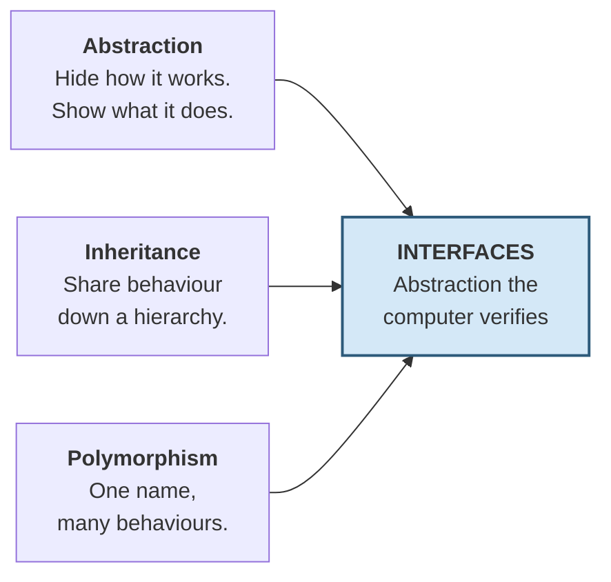

| Pillar | What you learned | What today adds |
|---|---|---|
| **Abstraction** | A class hides internals behind methods | A **contract** saying which methods *must* exist — enforced |
| **Inheritance** | A child inherits working code | A child can inherit an **obligation** instead of code |
| **Polymorphism** | Different classes share a method name | A **guarantee** they actually do — checked before production |
| **Encapsulation** | Internals protected by convention | The public surface becomes a formal promise |

> [!NOTE]
> **One honest warning.** Python has **no `interface` keyword**. If you are looking for one, you will not find it. Python has *three* mechanisms that each solve part of the problem, and much of this chapter is learning which to reach for.

---

# 3. The Story: Swiggy's Payment Problem

You have all ordered food online. You have all seen this screen:

```
  Choose Payment Method
  ─────────────────────
  ○  UPI
  ○  Credit / Debit Card
  ○  Swiggy Money (Wallet)
  ○  Net Banking
  ○  Cash on Delivery
```

Five options. Behind that screen is code. Let's follow how that code evolved — and how it slowly became a nightmare.

---

### 📅 Day 1 — Two payment methods, life is simple

A developer writes the checkout function. It handles UPI and Card.

```python
def checkout(method, amount):
    if method == "upi":
        return f"Paid ₹{amount} via UPI"
    elif method == "card":
        return f"Paid ₹{amount} via Card"
```

Clean. Readable. Ships on Friday. **Nothing wrong with this code.**

---

### 📅 Month 3 — Three more methods

Wallet, Net Banking, and Cash on Delivery are added. The function grows to five branches. Still fine.

But something else happened that nobody noticed.

The **same `if/elif` chain** now also exists in:

| File | Why it needs the chain |
|---|---|
| `checkout.py` | to charge the customer |
| `refund.py` | to reverse a cancelled order |
| `receipt.py` | to print the right logo |
| `analytics.py` | to count usage per method |
| `fraud_check.py` | different rules per method |
| `settlement.py` | different bank timings |

**Six copies of the same chain**, in six files, maintained by four different people.

---

### 📅 Month 7 — The new method

Swiggy launches **Swiggy Money**, its own wallet, with cashback.

A developer named **Anjali** adds it. She carefully updates the `if/elif` chain in `checkout.py`, `receipt.py`, `analytics.py`, `fraud_check.py`, and `settlement.py`.

**Five out of six.**

She missed `refund.py`.

Nothing warned her. The code imported fine. Every test passed. It deployed on a Friday.

---

### 📅 Month 7, 9:15 PM — The failure

A customer orders biryani for ₹450 using Swiggy Money. The restaurant is closed. The order auto-cancels.

The refund service runs its chain:

```python
if method == "upi":         ...
elif method == "card":      ...
elif method == "wallet":    ...
elif method == "netbanking":...
elif method == "cod":       ...
# no branch for "swiggy_money"  →  falls through, returns None
```

No crash. No error. No log. **The function simply returned `None`** and the system marked the refund as processed.

Over the next 6 days: **11,000 customers**, **₹47 lakh** in refunds that never happened.

> [!WARNING]
> Read that again. **There was no error message.** An `if/elif` chain with no matching branch does not crash — it silently falls off the end and returns `None`. That is the most dangerous kind of bug: the kind that looks like success.

---

### 📅 Month 9 — Two more problems surface

**Problem A — Testing.** A developer wants to test `checkout()`. But testing it means making a **real payment** with **real money**. So nobody tests it properly.

**Problem B — The bank partnership.** Swiggy partners with a bank offering EMI. The bank ships a Python SDK — a class called `BankEMIClient` that Swiggy **cannot modify**. It doesn't fit the `if/elif` chain, and it can't inherit from anything Swiggy wrote.

---

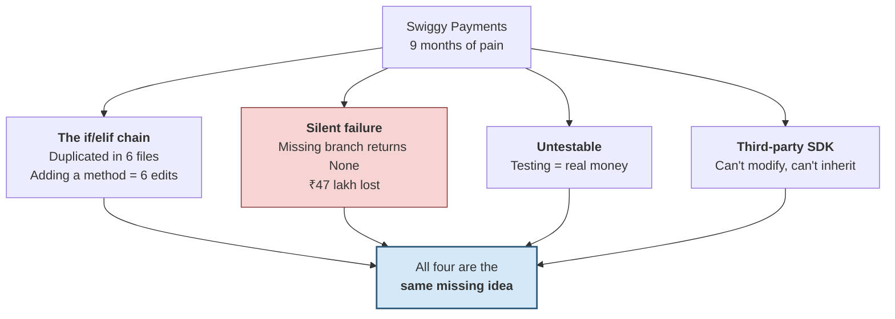

Four expensive problems. **One missing concept.** By the end of this chapter you will have fixed all four.

---

# 4. First Principle Thinking

> [!IMPORTANT]
> **Stop. Do not read ahead.** Sit with these questions. Discuss them with the person next to you. The answers *are* the chapter — derive them yourself and you will never forget them.

---

### Question 1 — What is actually wrong with `if/elif`?

```python
def checkout(method, amount):
    if method == "upi":       return f"Paid ₹{amount} via UPI"
    elif method == "card":    return f"Paid ₹{amount} via Card"
    elif method == "wallet":  return f"Paid ₹{amount} via Wallet"
```

It works. It's readable. So what's the problem?

Ask yourself: **to add one new payment method, how many files must I edit?** And **what happens if I forget one?**

---

### Question 2 — Where should "how to pay by UPI" live?

Right now, the knowledge of *how UPI works* is scattered across six files.

**Should it be?** Or should everything about UPI live in one place, and everything about Card in another?

You already know the pillar that answers this. Which one?

---

### Question 3 — When does a bug get discovered?

Anjali forgot one branch. Walk the timeline honestly:

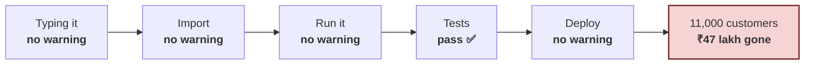

Now the crucial follow-up: **what does the same bug cost at each stage?**

| Caught at | Realistic cost |
|---|---|
| While typing | ₹0 — fixed in 4 seconds |
| At import | ₹0 — fixed in 30 seconds |
| In tests | ~₹500 — a few minutes |
| In code review | ~₹2,000 — two people's time |
| In staging | ~₹20,000 — a release cycle |
| **In production** | **₹47,00,000** — Swiggy's actual loss |

> ## An interface is a machine for moving a bug leftward on that line.
>
> That is the entire value proposition. Everything else is mechanism.

---

### Question 4 — Who can check, and when?

Python is dynamically typed. No compiler checks method names. So *who* checks — and when *could* they?

| Moment | What Python already knows |
|---|---|
| Writing the file | Nothing — it's just text |
| `import payments` | The class body has run. **Every method name is known** |
| `obj = UPI()` | An instance is being built |
| `obj.pay(450)` | The method is being looked up |

Look at row 2. **At import time Python already knows every method a class has.** It could compare that against a required list — *if a required list existed anywhere.*

That is the opening we will exploit.

---

### Question 5 — How do you test payment code without real money?

To test `checkout()`, you must charge a real card. So nobody tests it.

What would have to change so you could swap in a **fake** payment method during tests — one that records what happened but moves no money?

---

### Question 6 — Does the bank's SDK count?

`BankEMIClient` is third-party. You cannot edit it. It cannot inherit from your code.

But it **does** have `pay()` and `refund()` methods.

**Should it count as a valid payment method?** There are two defensible answers:

- **"No — it never declared itself as one of ours."** Membership by *declaration*.
- **"Yes — it has everything we need."** Membership by *shape*.

Hold on to both. Python gives you a tool for each.

---

# 5. The Problem Without Interfaces

Let's fix Swiggy's code step by step, and watch each attempt improve — and then fail.

## Attempt 1 — The `if/elif` chain

```python
def checkout(method, amount):
    if method == "upi":
        return f"Paid ₹{amount} via UPI"
    elif method == "card":
        return f"Paid ₹{amount} via Card"
    elif method == "wallet":
        return f"Paid ₹{amount} via Wallet"
    else:
        return "Unknown payment method"

def refund(method, amount):
    if method == "upi":
        return f"Refunded ₹{amount} to UPI"
    elif method == "card":
        return f"Refunded ₹{amount} to Card"
    # 'wallet' branch forgotten!
    else:
        return None                        # 💀 silent failure

print("checkout upi   :", checkout("upi", 450))
print("checkout wallet:", checkout("wallet", 450))
print("refund   upi   :", refund("upi", 450))
print("refund   wallet:", refund("wallet", 450), "  ← 💀 SILENT FAILURE")
```

**Output:**
```
checkout upi   : Paid ₹450 via UPI
checkout wallet: Paid ₹450 via Wallet
refund   upi   : Refunded ₹450 to UPI
refund   wallet: None   ← 💀 SILENT FAILURE
```

**This is Anjali's ₹47-lakh bug**, in eight lines.

No exception. No warning. The function returned `None` and the caller happily continued. That is what makes it so expensive — **nothing looked wrong**.

### Why `if/elif` fails at scale

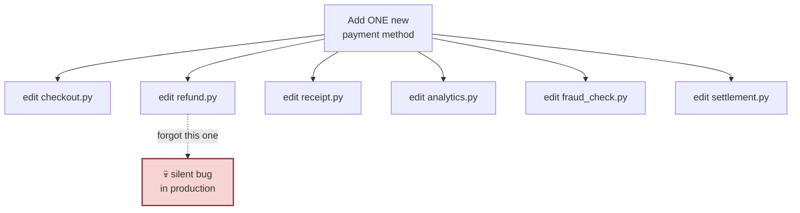

| # | Problem | Consequence |
|---|---|---|
| 1 | Knowledge is **scattered** | UPI logic lives in 6 files, not 1 |
| 2 | Adding a method means **editing existing code** | Every edit risks breaking what worked |
| 3 | A missing branch **fails silently** | `None` returned; no error raised |
| 4 | Nothing lists what a payment method **must** do | New developers guess |

> [!TIP]
> **A rule you can use immediately:** when you see an `if/elif` chain switching on a *type* or *kind*, and that same chain appears in more than one place — **that is a class hierarchy trying to be born.**

---

## Attempt 2 — Classes and duck typing

Let's apply what you already know. One class per payment method. Everything about UPI lives in `UPI`.

```python
class UPI:
    def pay(self, amount):
        return f"Paid ₹{amount} via UPI"
    def refund(self, amount):
        return f"Refunded ₹{amount} to UPI"

class Card:
    def pay(self, amount):
        return f"Paid ₹{amount} via Card"
    def refund(self, amount):
        return f"Refunded ₹{amount} to Card"

class SwiggyMoney:
    def make_payment(self, amount):        # ⚠️ 'make_payment', not 'pay'
        return f"Paid ₹{amount} via Swiggy Money"
    # refund() missing entirely


def checkout(method, amount):              # no if/elif anywhere!
    return method.pay(amount)

print(checkout(UPI(), 450))
print(checkout(Card(), 450))
print(checkout(SwiggyMoney(), 450))
```

**Output:**
```
Paid ₹450 via UPI
Paid ₹450 via Card
Traceback (most recent call last):
  ...
AttributeError: 'SwiggyMoney' object has no attribute 'pay'
```

### This is genuinely a big improvement

| Before | After |
|---|---|
| `if/elif` in 6 files | **Zero** `if/elif` — `checkout` is one line |
| Adding a method = edit 6 files | Adding a method = **write 1 new class** |
| UPI logic scattered | UPI logic in one place |
| Silent `None` | A **loud** `AttributeError` |

`checkout()` never changes again. This is **polymorphism** doing real work.

### But two problems remain

**Problem 1 — Nothing says what a payment method must be.**

Anjali wrote `make_payment` instead of `pay`. Nothing told her the required name. She had to read the other classes and guess.

**Problem 2 — The error still arrives too late.**

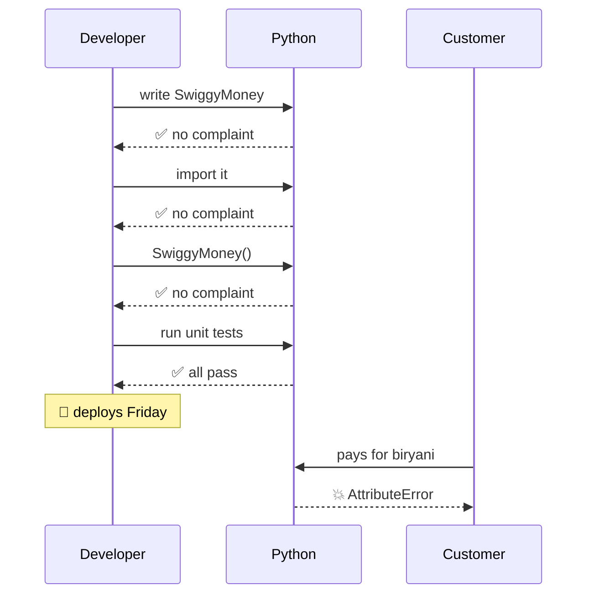

Five checkpoints. The bug walked through **all of them**.

> [!WARNING]
> This is the difference between a *bug* and a *design flaw*. A bug is something a careful person avoids. Anjali **was** careful. Her tests passed because she wrote them against her own class. There was no moment where she could reasonably have caught this.

---

## Attempt 3 — A base class with `NotImplementedError`

Most teams try this next, and it *feels* like an interface.

```python
class PaymentMethod:
    """Base class. Subclasses must override everything."""
    def pay(self, amount):
        raise NotImplementedError("Subclasses must implement pay()")
    def refund(self, amount):
        raise NotImplementedError("Subclasses must implement refund()")


class SwiggyMoney(PaymentMethod):
    def pay(self, amount):
        return f"Paid ₹{amount} via Swiggy Money"
    # refund() still forgotten


sm = SwiggyMoney()
print("Instantiated fine :", type(sm).__name__)
print("Payment works     :", sm.pay(450))
print("Now a cancellation arrives...")
sm.refund(450)
```

**Output:**
```
Instantiated fine : SwiggyMoney
Payment works     : Paid ₹450 via Swiggy Money
Now a cancellation arrives...
Traceback (most recent call last):
  ...
NotImplementedError: Subclasses must implement refund()
```

**Better again!** The message now tells you exactly what to do. That is real progress.

But look at *when* it fired. **Still at call time.** We improved the message; we did not improve the **timing**. The bug still reaches production — it just complains more clearly once it gets there.

And there is a second problem:

```python
class PaymentMethod:
    def pay(self, amount):
        raise NotImplementedError

p = PaymentMethod()                # the abstract base is instantiable!
print("Created a bare PaymentMethod:", type(p).__name__)
```

**Output:**
```
Created a bare PaymentMethod: PaymentMethod
```

You just created a payment method that cannot pay. Nothing stopped you. That object can now be passed around your system and will fail far from where it was created.

---

## Scoring the three attempts

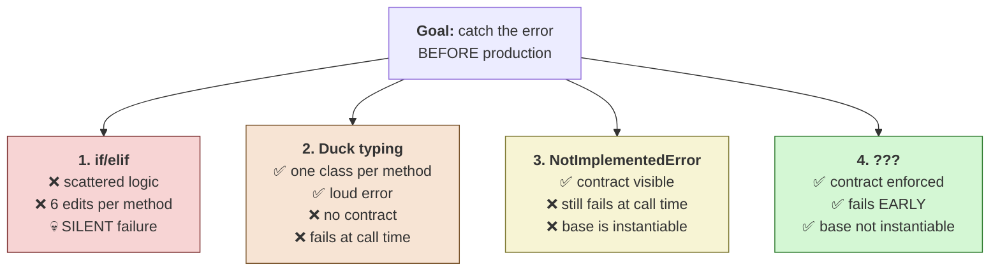

We are one step away. We need something that checks the contract **at instantiation** rather than at call time — because at instantiation, Python already knows every method the class has.

That mechanism has a name.

---

# 6. Introducing the Concept

Forget the textbook definition. Here it is in one sentence:

> ## An interface is a promise about what an object can do, written in a place the computer can check.

Three words carry the whole meaning:

### 🔹 "Promise"
It says **what**, never **how**. `PaymentMethod` promises that `pay(amount)` exists and charges the customer. It says nothing about UPI protocols, card networks, or wallet balances.

### 🔹 "Written"
It lives in **one file**, in **one place**. A new developer reads *one* thing to learn the shape — instead of reverse-engineering five classes.

### 🔹 "The computer can check"
This is what duck typing lacks. A comment is a promise. A wiki page is a promise. An interface is an **enforced** promise — one with teeth.

---

## An analogy that always lands

> A **driving licence** does not teach you to drive.
>
> It does not care whether you drive a Swift, a Thar, or a truck.
>
> It certifies exactly one thing: *this person can steer, brake, signal, and read road signs.*
>
> A traffic officer verifies it in two seconds without ever watching you drive.
>
> **That is an interface.** A checkable certificate of capability, separate from implementation.

---

## Python's three levels of enforcement

Here is the map for the rest of the chapter:

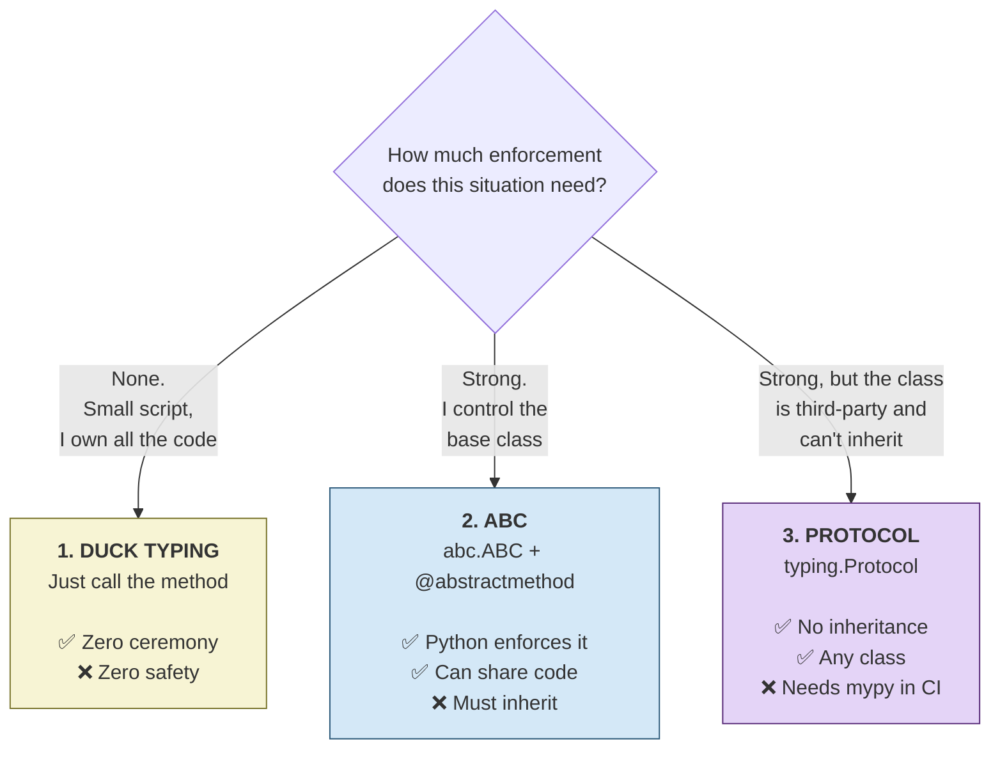

| | Duck typing | ABC | Protocol |
|---|---|---|---|
| Contract written down? | ❌ | ✅ | ✅ |
| Enforced by | nobody | **Python, at instantiation** | **mypy, before you run** |
| Class must inherit? | ❌ | ✅ | ❌ |
| Works on third-party classes? | ✅ | ❌ | ✅ |
| Can donate shared code? | ❌ | ✅ | ⚠️ limited |

> [!TIP]
> **The rule of thumb you can use today:**
>
> Use an **ABC** when you own the classes. Use a **Protocol** when you don't. Use **duck typing** for scripts under 100 lines.
>
> The rest of this chapter earns you the right to break that rule intelligently.

---

# 7. Case Study: Swiggy Payments

We return to this system in every section. Here is the target design.

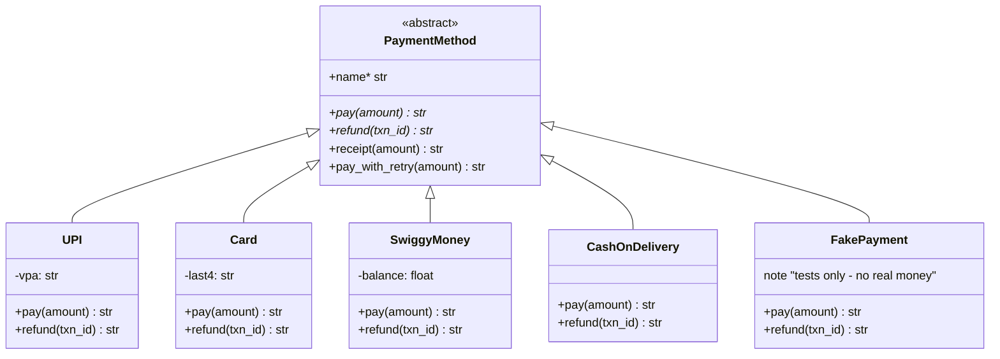

`*` marks abstract members. `receipt()` and `pay_with_retry()` are **concrete** — written once in the base, inherited free by all five.

## How the four problems get solved

| Problem | Solved by |
|---|---|
| `if/elif` in 6 files | **Polymorphism** — one class per method, no chains |
| Missing branch → ₹47 lakh | **`@abstractmethod`** — `SwiggyMoney()` refuses to be created |
| Untestable (real money) | **`FakePayment`** — a fifth implementation used in tests |
| Third-party bank SDK | **`Protocol`** — accepts it without inheritance |

## Before and after

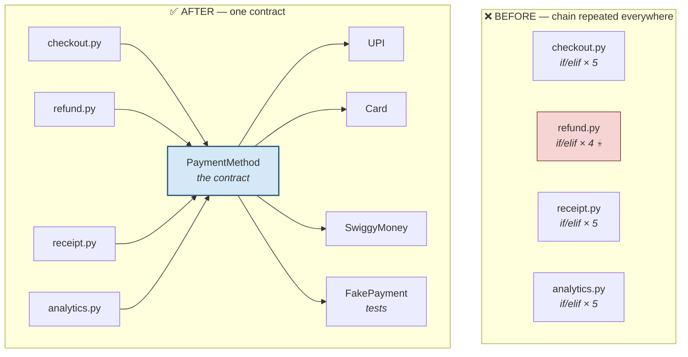

---

# 8. Beginner Example

The smallest possible interface, with **every line explained**.

```python
from abc import ABC, abstractmethod


class PaymentMethod(ABC):
    """The contract every Swiggy payment method must satisfy."""

    @abstractmethod
    def pay(self, amount):
        """Charge the customer. Return a confirmation string."""

    @abstractmethod
    def refund(self, amount):
        """Return money to the customer. Return a confirmation string."""


class UPI(PaymentMethod):
    def __init__(self, vpa):
        self.vpa = vpa

    def pay(self, amount):
        return f"Paid ₹{amount} from {self.vpa}"

    def refund(self, amount):
        return f"Refunded ₹{amount} to {self.vpa}"


upi = UPI("anjali@okaxis")
print(upi.pay(450))
print(upi.refund(450))
```

**Output:**
```
Paid ₹450 from anjali@okaxis
Refunded ₹450 to anjali@okaxis
```

## Line by line

| Line | What it does and why |
|---|---|
| `from abc import ABC, abstractmethod` | `abc` = **A**bstract **B**ase **C**lasses, a standard-library module. You need both names. |
| `class PaymentMethod(ABC):` | Inheriting `ABC` is what makes this special. `ABC` is a tiny helper whose only job is to set the **metaclass** to `ABCMeta` — and `ABCMeta` does the actual enforcing. |
| `"""The contract…"""` | The docstring **is** part of the interface — the human half of the contract. |
| `@abstractmethod` | Marks the method as *required*. It sets `pay.__isabstractmethod__ = True`, a flag `ABCMeta` reads later. |
| `def pay(self, amount):` | The **signature** is the machine-readable half: name, parameters, order. |
| `"""Charge the customer…"""` | No `pass`, no `return` — the docstring is the whole body. Valid Python and the cleanest style. |
| `class UPI(PaymentMethod):` | Declares "I promise to satisfy this contract." Python will verify it. |
| `def pay` / `def refund` | The implementations. Both required methods present → promise kept. |
| `upi = UPI(...)` | **This is the checkpoint.** Python counts unimplemented abstract methods here. Zero left → the object is created. |

> [!NOTE]
> **Three valid ways to write an empty abstract body.** You will see all three:
> ```python
> @abstractmethod
> def pay(self, amount):
>     """Docstring only."""      # ✅ best — documents while declaring
>
> @abstractmethod
> def pay(self, amount): ...     # ✅ the Ellipsis literal, very common
>
> @abstractmethod
> def pay(self, amount): pass    # ✅ works, but says nothing
> ```

## Now watch the contract do its job

This is **Anjali's exact bug** — the one that cost ₹47 lakh.

```python
from abc import ABC, abstractmethod


class PaymentMethod(ABC):
    @abstractmethod
    def pay(self, amount): ...
    @abstractmethod
    def refund(self, amount): ...


class SwiggyMoney(PaymentMethod):
    def pay(self, amount):
        return f"Paid ₹{amount} via Swiggy Money"
    # refund() forgotten — exactly Anjali's mistake


try:
    sm = SwiggyMoney()
except TypeError as e:
    print("BLOCKED:", e)
```

**Output:**
```
BLOCKED: Can't instantiate abstract class SwiggyMoney without an implementation for abstract method 'refund'
```

**Read that error message closely.** It does not just say "you failed." It **names the exact method you forgot**.

And it happened on the developer's laptop, the first time they ran the code — not at 9:15 PM on a Friday with 11,000 customers waiting.

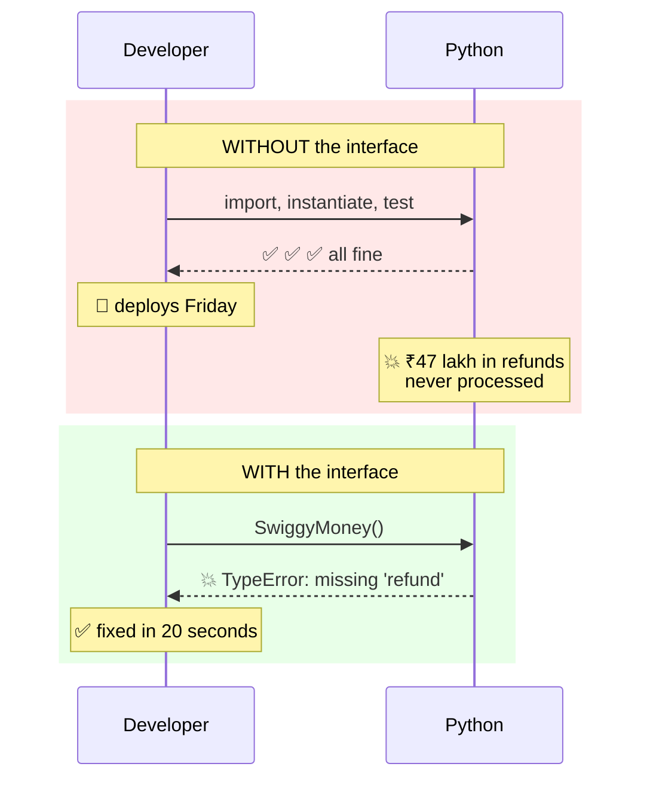

That single error message **is the whole chapter**.

---
# 9. Intermediate Example

The beginner version had two methods and no shared code. Real interfaces do more work.

Three new ideas: **concrete methods**, an **abstract property**, and the **Template Method** pattern.

```python
from abc import ABC, abstractmethod


class PaymentMethod(ABC):
    """Contract for every Swiggy payment method."""

    # ---------- REQUIRED ----------
    @property
    @abstractmethod
    def name(self) -> str:
        """Display name shown on the checkout screen."""

    @abstractmethod
    def pay(self, amount: float) -> str: ...

    @abstractmethod
    def refund(self, amount: float) -> str: ...

    @abstractmethod
    def is_available(self) -> bool:
        """False if this method can't be used right now."""

    # ---------- PROVIDED — written once, inherited by all ----------
    def receipt(self, amount: float) -> str:
        return f"--- SWIGGY RECEIPT ---\n Method: {self.name}\n Amount: ₹{amount}"

    def pay_with_fallback(self, amount, fallback=None):
        """Template method — built from the abstract operations above."""
        if self.is_available():
            return self.pay(amount)
        if fallback is not None:
            return f"[{self.name} unavailable] " + fallback.pay(amount)
        return f"[{self.name} unavailable] and no fallback given"

    def describe(self) -> str:
        status = "available" if self.is_available() else "unavailable"
        return f"<{type(self).__name__} name={self.name!r} {status}>"


class UPI(PaymentMethod):
    def __init__(self, vpa, server_up=True):
        self.vpa, self.server_up = vpa, server_up

    @property
    def name(self): return "UPI"

    def pay(self, amount): return f"Paid ₹{amount} from {self.vpa}"
    def refund(self, amount): return f"Refunded ₹{amount} to {self.vpa}"
    def is_available(self): return self.server_up


class SwiggyMoney(PaymentMethod):
    def __init__(self, balance):
        self.balance = balance

    @property
    def name(self): return "Swiggy Money"

    def pay(self, amount):
        self.balance -= amount
        return f"Paid ₹{amount} from wallet (₹{self.balance} left)"

    def refund(self, amount):
        self.balance += amount
        return f"Refunded ₹{amount} to wallet (₹{self.balance} now)"

    def is_available(self): return self.balance > 0


upi = UPI("anjali@okaxis")
wallet = SwiggyMoney(balance=1000)

for m in (upi, wallet):
    print(m.describe())
    print(m.pay(450))
    print(m.receipt(450))
    print()

# UPI servers go down — fallback to the wallet
upi_down = UPI("anjali@okaxis", server_up=False)
print(upi_down.describe())
print(upi_down.pay_with_fallback(450, fallback=wallet))
```

**Output:**
```
<UPI name='UPI' available>
Paid ₹450 from anjali@okaxis
--- SWIGGY RECEIPT ---
 Method: UPI
 Amount: ₹450

<SwiggyMoney name='Swiggy Money' available>
Paid ₹450 from wallet (₹550 left)
--- SWIGGY RECEIPT ---
 Method: Swiggy Money
 Amount: ₹450

<UPI name='UPI' unavailable>
[UPI unavailable] Paid ₹450 from wallet (₹100 left)
```

## What just happened — three new ideas

### Idea 1: An ABC can contain working code

`receipt()`, `pay_with_fallback()`, and `describe()` are **concrete**. Written once, inherited by every payment method forever.

This is the biggest practical advantage of an ABC. Without it, `receipt()` would be copy-pasted into UPI, Card, SwiggyMoney, NetBanking, and COD — five copies, five places to fix a bug, five chances to drift apart.

> [!NOTE]
> This is why Python does not need Java's split between `interface` and `abstract class`. In Java an interface historically could not hold code, so you needed both. Python's `ABC` does both jobs.

### Idea 2: The Template Method pattern

Look at `pay_with_fallback()`:

```python
def pay_with_fallback(self, amount, fallback=None):
    if self.is_available():          # abstract
        return self.pay(amount)      # abstract
    ...
```

It is **real, working logic built entirely from methods that do not exist yet**. The base defines the *algorithm*; subclasses supply the *steps*.

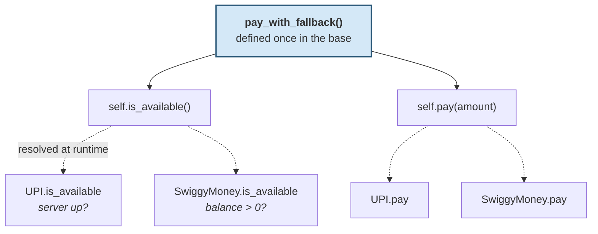

This is **polymorphism** — the pillar you already know — used as a design tool. `pay_with_fallback()` works on payment methods that had not been invented when it was written.

**Business value:** Swiggy's automatic fallback ("UPI is down, use your wallet?") is written **once**. Every payment method gets it. Add EMI tomorrow and it inherits the fallback behaviour free.

### Idea 3: Abstract properties

```python
@property
@abstractmethod          # ⚠️ ORDER MATTERS
def name(self) -> str: ...
```

Contracts can require **data**, not just behaviour. `@property` must sit **on top**.

Decorators apply bottom-up: `abstractmethod` marks the raw function first, then `property` wraps the marked function and carries the flag through. Reverse them and modern Python stops you immediately at class-definition time — see [Mistake 2](#mistake-2--decorator-order-).

---

# 10. Industry Level Example

Interfaces are not academic. Here is where you have already used them without noticing.

## 10.1 Razorpay / Stripe — the real payment abstraction

Every payment aggregator in the world is built on exactly the pattern you just learned. Their public API is a contract, and each underlying bank or network is an implementation.

```python
# Conceptual shape of a payment aggregator
class PaymentInstrument(ABC):
    @abstractmethod
    def authorize(self, amount, currency): ...
    @abstractmethod
    def capture(self, auth_id): ...
    @abstractmethod
    def refund(self, txn_id, amount): ...

# Implementations: HDFCNetBanking, ICICINetBanking, VisaCard,
#                  MastercardCard, PhonePeUPI, GPayUPI, PaytmWallet...
```

**This is why you can switch from Razorpay to Stripe by changing configuration.** Your code depends on the contract, not the vendor.

## 10.2 Django — the storage backend API

Django's file storage is the same idea:

```python
# Simplified from django.core.files.storage
class Storage:
    def _save(self, name, content):
        raise NotImplementedError('subclasses must implement _save()')
    def delete(self, name):
        raise NotImplementedError('subclasses must implement delete()')
    def exists(self, name):
        raise NotImplementedError('subclasses must implement exists()')

    def save(self, name, content, max_length=None):     # Django PROVIDES this
        name = self.get_available_name(name, max_length)
        return self._save(name, content)
```

One settings line switches your entire file storage vendor:

```python
STORAGES = {"default": {"BACKEND": "storages.backends.s3.S3Storage"}}
```

> [!NOTE]
> Notice Django uses the `NotImplementedError` style, not `ABC`. This is **historical** — Django predates widespread `abc` adoption, and changing it would break thousands of third-party backends. Modern Django code does use `ABC`. Real codebases contain both styles; recognise them both.

## 10.3 `collections.abc` — interfaces in the standard library

Python's own container types are defined by interfaces. This is why `for x in y` works on lists, strings, dicts, files, and generators.

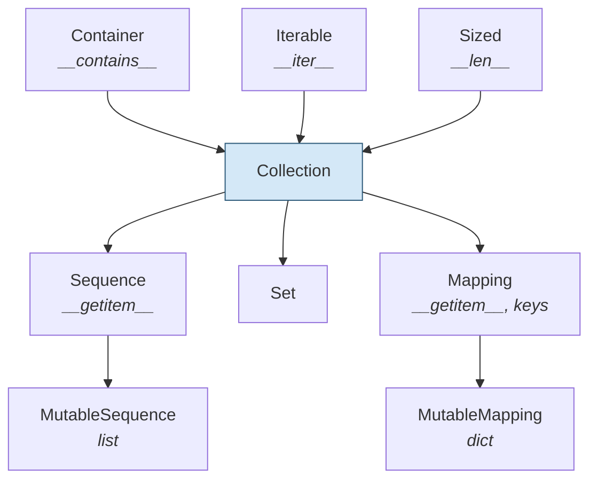

Each level requires a small set of methods and **donates** many more — Example 12 proves it.

## 10.4 PyTorch — `nn.Module`

```python
import torch.nn as nn                      # illustrative

class MyModel(nn.Module):
    def __init__(self):
        super().__init__()
        self.layer = nn.Linear(10, 1)

    def forward(self, x):                  # ← the contract
        return self.layer(x)
```

`forward()` is the interface. PyTorch's entire training loop, autograd engine, and GPU dispatcher are written against it. Every model ever published — ResNet, BERT, GPT — satisfies this one-method contract.

## 10.5 Where else you'll meet them

| System | The interface | What it enables |
|---|---|---|
| **Razorpay / Stripe** | authorize / capture / refund | Swap payment vendors via config |
| **Django** | `Storage`, `BaseCache`, auth backends | Swap storage/cache/auth vendors |
| **FastAPI / Starlette** | ASGI callable `(scope, receive, send)` | Any ASGI server runs any ASGI app |
| **Flask / WSGI** | `app(environ, start_response)` | Gunicorn, uWSGI, Waitress all run Flask |
| **scikit-learn** | `fit()` / `transform()` / `predict()` | `Pipeline` chains any estimator, including yours |
| **PyTorch** | `nn.Module.forward()` | One training loop for every model |
| **Python DB-API (PEP 249)** | `connect()`, `cursor()`, `execute()` | Switch PostgreSQL → MySQL → SQLite |
| **Python itself** | `__iter__`, `__len__`, `__enter__` | `for`, `len()`, `with` work on your classes |

> [!TIP]
> **The pattern to notice:** in every case, the interface exists so that *someone else's code can use your class*. Django's team wrote `save()` years before your storage backend existed. That is what an interface buys — **code that works with implementations that don't exist yet.**

---

# 11. The Twenty Code Examples

Each teaches exactly **one** idea. All are runnable as-is.

---

### Example 1 — The `if/elif` chain and its silent failure 💀

```python
def refund(method, amount):
    if method == "upi":
        return f"Refunded ₹{amount} to UPI"
    elif method == "card":
        return f"Refunded ₹{amount} to Card"
    elif method == "wallet":
        return f"Refunded ₹{amount} to Wallet"
    # 'swiggy_money' branch was never added

for m in ["upi", "card", "wallet", "swiggy_money"]:
    result = refund(m, 450)
    flag = "" if result else "   ← 💀 SILENT FAILURE, no error raised"
    print(f"{m:14} → {result}{flag}")
```

**Output:**
```
upi            → Refunded ₹450 to UPI
card           → Refunded ₹450 to Card
wallet         → Refunded ₹450 to Wallet
swiggy_money   → None   ← 💀 SILENT FAILURE, no error raised
```

**Explanation:** This is the ₹47-lakh bug in nine lines. When no branch matches, Python falls off the end of the function and returns `None` — **no exception, no warning**. The caller sees a falsy value and, if it doesn't check, continues as though the refund succeeded.

An `if/elif` chain without a final `else: raise` is a silent-failure machine.

---

### Example 2 — Duck typing kills the chain, but has no contract

```python
class UPI:
    def pay(self, amount): return f"Paid ₹{amount} via UPI"

class Card:
    def pay(self, amount): return f"Paid ₹{amount} via Card"

class SwiggyMoney:
    def make_payment(self, amount):        # wrong name
        return f"Paid ₹{amount} via Swiggy Money"

def checkout(method, amount):              # ← no if/elif at all
    return method.pay(amount)

for m in (UPI(), Card()):
    print(f"{type(m).__name__:12} → {checkout(m, 450)}")

try:
    checkout(SwiggyMoney(), 450)
except AttributeError as e:
    print(f"{'SwiggyMoney':12} → 💥 {e}")
```

**Output:**
```
UPI          → Paid ₹450 via UPI
Card         → Paid ₹450 via Card
SwiggyMoney  → 💥 'SwiggyMoney' object has no attribute 'pay'
```

**Explanation:** Huge progress — `checkout()` is now **one line** and never changes again when a payment method is added.

And notice the failure is now **loud**. An `AttributeError` is far better than a silent `None`.

But two things are still missing: nothing tells a developer that the method must be called `pay`, and the error still arrives when the method is *called*, not when the class is *written*.

---

### Example 3 — `NotImplementedError` improves the message, not the timing

```python
class PaymentMethod:
    def pay(self, amount):
        raise NotImplementedError("Subclasses must implement pay()")
    def refund(self, amount):
        raise NotImplementedError("Subclasses must implement refund()")

class SwiggyMoney(PaymentMethod):
    def pay(self, amount):
        return f"Paid ₹{amount} via Swiggy Money"

sm = SwiggyMoney()
print("Instantiated  :", type(sm).__name__)
print("Payment works :", sm.pay(450))
print("Order cancelled — refunding...")
try:
    sm.refund(450)
except NotImplementedError as e:
    print("Only NOW do we find out:", e)
```

**Output:**
```
Instantiated  : SwiggyMoney
Payment works : Paid ₹450 via Swiggy Money
Order cancelled — refunding...
Only NOW do we find out: Subclasses must implement refund()
```

**Explanation:** A clear message, delivered too late. The object existed, was passed around, and took a real payment before failing.

> **Rule:** use `NotImplementedError` for a method that is *optionally* overridden; use `@abstractmethod` for one that is *required*.

---

### Example 4 — `@abstractmethod` without `ABC` does absolutely nothing ⚠️

The single most common interface mistake in Python.

```python
from abc import abstractmethod            # note: ABC is NOT imported

class Broken:                              # ❌ does not inherit ABC
    @abstractmethod
    def pay(self, amount): ...

b = Broken()                               # no error whatsoever
print("Instantiated      :", type(b).__name__)
print("'abstract' method :", b.pay(450))
print("Flag was set      :", Broken.pay.__isabstractmethod__)
print("But nobody read it:", getattr(Broken, "__abstractmethods__", "attribute absent"))
```

**Output:**
```
Instantiated      : Broken
'abstract' method : None
Flag was set      : True
But nobody read it: attribute absent
```

**Explanation:** This is the mechanism laid bare. `@abstractmethod` **only sets a flag** — `__isabstractmethod__ = True`. It has no power of its own.

The *enforcement* lives in the `ABCMeta` metaclass, which scans for that flag and builds `__abstractmethods__`. No `ABCMeta` → nobody reads the flag → the decorator becomes a decorative comment.

> [!WARNING]
> **Always write `class X(ABC)`.** This bug is invisible: the code *looks* like it has an interface, reviewers see `@abstractmethod` and approve it, and there is zero enforcement.

---

### Example 5 — ABC blocks instantiation and names what's missing

```python
from abc import ABC, abstractmethod

class PaymentMethod(ABC):
    @abstractmethod
    def pay(self, amount): ...
    @abstractmethod
    def refund(self, amount): ...
    @abstractmethod
    def is_available(self): ...

class SwiggyMoney(PaymentMethod):
    def pay(self, amount):
        return f"Paid ₹{amount}"

try:
    SwiggyMoney()
except TypeError as e:
    print("BLOCKED:", e)
```

**Output:**
```
BLOCKED: Can't instantiate abstract class SwiggyMoney without an implementation for abstract methods 'is_available', 'refund'
```

**Explanation:** Python collects **all** unimplemented abstract methods across the whole inheritance chain and refuses instantiation, listing **every** missing name.

Implementing *some* of them buys you nothing — which is exactly right, since a payment method that can charge but not refund is worse than none at all.

---

### Example 6 — Abstractness propagates down the MRO 🎯

A favourite interview question.

```python
from abc import ABC, abstractmethod

class PaymentMethod(ABC):
    @abstractmethod
    def pay(self, amount): ...

class OnlinePayment(PaymentMethod):
    """Intermediate class: adds shared helpers, still abstract."""
    def is_online(self): return True

class UPI(OnlinePayment):
    def pay(self, amount): return f"Paid ₹{amount} via UPI"

print("Defining OnlinePayment was fine.")
try:
    OnlinePayment()
except TypeError as e:
    print("OnlinePayment() blocked:", str(e)[:58], "...")

u = UPI()
print("UPI() works       :", u.pay(450))
print("Inherited helper  :", u.is_online())
print("OnlinePayment reqs:", sorted(OnlinePayment.__abstractmethods__))
print("UPI reqs          :", sorted(UPI.__abstractmethods__))
```

**Output:**
```
Defining OnlinePayment was fine.
OnlinePayment() blocked: Can't instantiate abstract class OnlinePayment without an  ...
UPI() works       : Paid ₹450 via UPI
Inherited helper  : True
OnlinePayment reqs: ['pay']
UPI reqs          : []
```

**Explanation:** Two lessons in one.

1. **Defining an incomplete subclass is legal.** Only *instantiating* it fails. `class OnlinePayment(PaymentMethod)` raised nothing.
2. **Abstractness travels down** the chain until someone implements it.

And this is genuinely useful: `OnlinePayment` is a legitimate intermediate class that adds `is_online()` for UPI/Card/NetBanking while leaving `pay()` to its children. Cash on Delivery would not inherit from it.

---

### Example 7 — Looking inside the machinery

```python
from abc import ABC, abstractmethod

class PaymentMethod(ABC):
    @abstractmethod
    def pay(self, amount): ...
    @abstractmethod
    def refund(self, amount): ...
    def receipt(self, amount):
        return f"Receipt for ₹{amount}"

class UPI(PaymentMethod):
    def pay(self, amount): return f"Paid ₹{amount}"
    def refund(self, amount): return f"Refunded ₹{amount}"

print("PaymentMethod requires :", sorted(PaymentMethod.__abstractmethods__))
print("UPI still missing      :", sorted(UPI.__abstractmethods__))
print("pay flagged?           :", PaymentMethod.pay.__isabstractmethod__)
print("receipt flagged?       :", getattr(PaymentMethod.receipt, "__isabstractmethod__", False))
print("PaymentMethod metaclass:", type(PaymentMethod).__name__)
print("UPI instantiates       :", UPI().receipt(450))
```

**Output:**
```
PaymentMethod requires : ['pay', 'refund']
UPI still missing      : []
pay flagged?           : True
receipt flagged?       : False
PaymentMethod metaclass: ABCMeta
UPI instantiates       : Receipt for ₹450
```

**Explanation:** The entire enforcement mechanism, visible in six lines.

| Observation | What it tells you |
|---|---|
| `PaymentMethod.__abstractmethods__` = `{'pay','refund'}` | `ABCMeta` scanned the class body and collected every flagged method |
| `UPI.__abstractmethods__` is **empty** | UPI implemented both, so nothing is outstanding |
| `pay.__isabstractmethod__` is `True` | This flag is *all* `@abstractmethod` does |
| `receipt` has no flag | Concrete methods are untouched by the scan |
| The metaclass is `ABCMeta` | Inheriting `ABC` set this — it does the work |

**The rule in one line:** at instantiation, Python checks `cls.__abstractmethods__`. Empty → build the object. Non-empty → `TypeError` listing the names.

---

### Example 8 — Concrete methods and the Template Method pattern

```python
from abc import ABC, abstractmethod

class PaymentMethod(ABC):
    @abstractmethod
    def pay(self, amount): ...
    @abstractmethod
    def is_available(self): ...

    def pay_with_retry(self, amount, attempts=3):
        """The ALGORITHM, written once for every payment method."""
        for i in range(1, attempts + 1):
            if self.is_available():
                return f"[attempt {i}] {self.pay(amount)}"
        return f"Failed after {attempts} attempts"

class UPI(PaymentMethod):
    def __init__(self, fail_first=0):
        self.calls = 0
        self.fail_first = fail_first
    def pay(self, amount): return f"Paid ₹{amount} via UPI"
    def is_available(self):
        self.calls += 1
        return self.calls > self.fail_first

class CashOnDelivery(PaymentMethod):
    def pay(self, amount): return f"₹{amount} to be collected at the door"
    def is_available(self): return True

print(UPI().pay_with_retry(450))
print(UPI(fail_first=2).pay_with_retry(450))
print(CashOnDelivery().pay_with_retry(450))
```

**Output:**
```
[attempt 1] Paid ₹450 via UPI
[attempt 3] Paid ₹450 via UPI
[attempt 1] ₹450 to be collected at the door
```

**Explanation:** `pay_with_retry()` is complete, working logic assembled from two methods that don't exist in the base class. Subclasses fill in the *steps*; the base owns the *sequence*.

Add logging, metrics, or exponential backoff to `pay_with_retry()` and **every payment method in Swiggy gets it instantly**. That is the payoff.

---

### Example 9 — Abstract properties, classmethods and staticmethods

```python
from abc import ABC, abstractmethod

class PaymentMethod(ABC):
    @property
    @abstractmethod                    # property on TOP
    def name(self) -> str: ...

    @classmethod
    @abstractmethod                    # abstractmethod INNERMOST, always
    def from_config(cls, cfg): ...

    @staticmethod
    @abstractmethod
    def validate_amount(amount) -> bool: ...

class UPI(PaymentMethod):
    def __init__(self, vpa): self.vpa = vpa

    @property
    def name(self): return "UPI"

    @classmethod
    def from_config(cls, cfg): return cls(cfg["vpa"])

    @staticmethod
    def validate_amount(amount): return 1 <= amount <= 100000

print("Required :", sorted(PaymentMethod.__abstractmethods__))
u = UPI.from_config({"vpa": "anjali@okaxis"})
print("name     :", u.name)
print("vpa      :", u.vpa)
print("validate :", UPI.validate_amount(450), UPI.validate_amount(500000))
```

**Output:**
```
Required : ['from_config', 'name', 'validate_amount']
name     : UPI
vpa      : anjali@okaxis
validate : True False
```

**Explanation:** Contracts can require **data** (`name`), **alternative constructors** (`from_config`), and **utility functions** (`validate_amount`) — not only instance methods.

`from_config` is especially useful in real systems: it lets every payment method be built from a YAML/JSON config with one uniform call.

> [!WARNING]
> **Memorise the stacking order: `@abstractmethod` always goes innermost (bottom).** `@property`, `@classmethod`, and `@staticmethod` go above it. Get it backwards and modern Python raises immediately — see Mistake 2.

---

### Example 10 — Interface Segregation: many small contracts beat one fat one

```python
from abc import ABC, abstractmethod

# ❌ FAT INTERFACE
class PaymentFat(ABC):
    @abstractmethod
    def pay(self, amount): ...
    @abstractmethod
    def refund(self, amount): ...
    @abstractmethod
    def save_card(self): ...

class CashOnDeliveryFat(PaymentFat):
    def pay(self, amount): return "collect at door"
    def refund(self, amount):
        raise NotImplementedError("COD refunds are handled in cash")  # 🚩
    def save_card(self):
        raise NotImplementedError("COD has no card to save")          # 🚩

# ✅ SEGREGATED
class Payable(ABC):
    @abstractmethod
    def pay(self, amount): ...

class Refundable(ABC):
    @abstractmethod
    def refund(self, amount): ...

class Tokenizable(ABC):
    @abstractmethod
    def save_card(self): ...

class CashOnDelivery(Payable):                        # only what it can do
    def pay(self, amount): return f"₹{amount} at the door"

class UPI(Payable, Refundable):
    def pay(self, amount): return f"Paid ₹{amount} via UPI"
    def refund(self, amount): return f"Refunded ₹{amount} to UPI"

class Card(Payable, Refundable, Tokenizable):         # all three
    def pay(self, amount): return f"Paid ₹{amount} via Card"
    def refund(self, amount): return f"Refunded ₹{amount} to Card"
    def save_card(self): return "card tokenised"

methods = [CashOnDelivery(), UPI(), Card()]
print("Can pay    :", [type(m).__name__ for m in methods if isinstance(m, Payable)])
print("Can refund :", [type(m).__name__ for m in methods if isinstance(m, Refundable)])
print("Can save   :", [type(m).__name__ for m in methods if isinstance(m, Tokenizable)])
```

**Output:**
```
Can pay    : ['CashOnDelivery', 'UPI', 'Card']
Can refund : ['UPI', 'Card']
Can save   : ['Card']
```

**Explanation:** The **Interface Segregation Principle** — the *I* in SOLID — says no class should be forced to implement methods it does not need.

This example is a real Swiggy situation: **Cash on Delivery genuinely cannot do an online refund.** Forcing it to implement `refund()` produces a lie.

> [!TIP]
> **The diagnostic:** if a class satisfies an interface by writing `raise NotImplementedError`, the interface is too big. That exception is your design telling you it is unhappy.

Notice also how clean the filtering became: `isinstance(m, Refundable)` answers "can this be refunded online?" with no `if/elif` and no hardcoded list of method names.

---

### Example 11 — Dependency Injection makes payments testable

This fixes Swiggy's "testing costs real money" problem.

```python
from abc import ABC, abstractmethod

class PaymentMethod(ABC):
    @abstractmethod
    def pay(self, amount): ...
    @abstractmethod
    def refund(self, amount): ...

class UPI(PaymentMethod):
    def pay(self, amount): return f"REAL charge of ₹{amount}"     # real money!
    def refund(self, amount): return f"REAL refund of ₹{amount}"

class FakePayment(PaymentMethod):
    """Test double — records everything, moves no money."""
    def __init__(self):
        self.charges, self.refunds = [], []
    def pay(self, amount):
        self.charges.append(amount)
        return f"FAKE charge of ₹{amount}"
    def refund(self, amount):
        self.refunds.append(amount)
        return f"FAKE refund of ₹{amount}"


# ❌ BEFORE — creates its own dependency, untestable
def place_order_bad(amount):
    return UPI().pay(amount)              # hard-wired to real money

# ✅ AFTER — receives its dependency
def place_order(payment: PaymentMethod, amount, cancelled=False):
    result = payment.pay(amount)
    if cancelled:
        result += " | " + payment.refund(amount)
    return result


print("Production:", place_order(UPI(), 450))

fake = FakePayment()
print("Test      :", place_order(fake, 450, cancelled=True))
print("Charged   :", fake.charges)
print("Refunded  :", fake.refunds)
assert fake.charges == [450] and fake.refunds == [450]
print("✅ Test passed — and not one rupee moved")
```

**Output:**
```
Production: REAL charge of ₹450
Test      : FAKE charge of ₹450 | FAKE refund of ₹450
Charged   : [450]
Refunded  : [450]
✅ Test passed — and not one rupee moved
```

**Explanation:** The only change was moving `payment` from a local variable to a **parameter**. That is **Dependency Injection**, and it is what turns the **Dependency Inversion Principle** (the *D* in SOLID) into code.

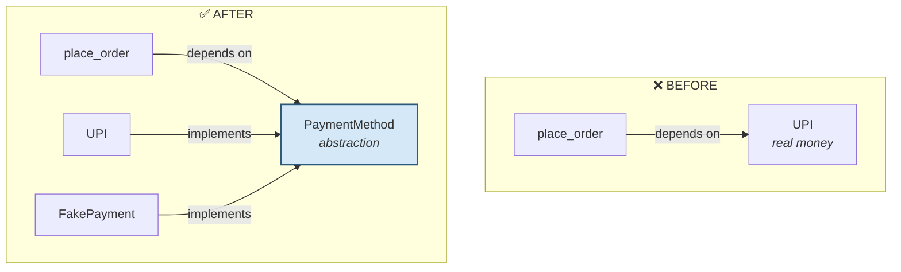

Both the function *and* the concrete classes now depend on the abstraction. The arrow into real-money code has been **inverted** — hence the name.

**And notice the assertion.** You can now test *exactly* what was charged and refunded — something impossible when the code created its own `UPI()`.

---

### Example 12 — `collections.abc` gives you free behaviour 🎁

The strongest argument for ABC over Protocol.

```python
from collections.abc import Sequence

class Cart(Sequence):
    def __init__(self, items):
        self._items = list(items)
    def __getitem__(self, i):        # you write only
        return self._items[i]
    def __len__(self):               # these two
        return len(self._items)

cart = Cart(["Biryani", "Dosa", "Coke", "Gulab Jamun"])

print("len()      :", len(cart))                     # you wrote this
print("cart[2]    :", cart[2])                       # you wrote this
print("in         :", "Dosa" in cart)                # 🎁 free
print("iterate    :", [i[:4] for i in cart])         # 🎁 free
print("reversed   :", list(reversed(cart))[0])       # 🎁 free
print(".index()   :", cart.index("Coke"))            # 🎁 free
print(".count()   :", cart.count("Dosa"))            # 🎁 free
print("slicing    :", cart[1:3])                     # 🎁 free
print("isinstance :", isinstance(cart, Sequence))
```

**Output:**
```
len()      : 4
cart[2]    : Coke
in         : True
iterate    : ['Biry', 'Dosa', 'Coke', 'Gula']
reversed   : Gulab Jamun
.index()   : 2
.count()   : 1
slicing    : ['Dosa', 'Coke']
isinstance : True
```

**Explanation:** You wrote **2** methods and received **8** behaviours.

`Sequence` implements `__contains__`, `__iter__`, `__reversed__`, `index()`, and `count()` **in terms of** `__getitem__` and `__len__`. These are called **mixin methods**.

> [!TIP]
> **This is the killer feature ABCs have and Protocols do not: an ABC can give you code.**
>
> | Inherit | You implement | You get free |
> |---|---|---|
> | `Sequence` | `__getitem__`, `__len__` | `__contains__`, `__iter__`, `__reversed__`, `index`, `count` |
> | `MutableSequence` | + `__setitem__`, `__delitem__`, `insert` | `append`, `extend`, `pop`, `remove`, `__iadd__` |
> | `Mapping` | `__getitem__`, `__len__`, `__iter__` | `keys`, `values`, `items`, `get`, `__contains__`, `__eq__` |
> | `Set` | `__contains__`, `__iter__`, `__len__` | `&`, `\|`, `-`, `^`, `isdisjoint`, comparisons |

---
### Example 13 — `Protocol`: structural typing, zero inheritance

The fix for Swiggy's bank-SDK problem.

```python
from typing import Protocol

class Payable(Protocol):
    """Anything with this shape counts as a payment method."""
    def pay(self, amount: float) -> str: ...


class BankEMIClient:                  # ⚠️ third-party — inherits NOTHING
    def pay(self, amount):
        return f"₹{amount} split into 3 EMIs by HDFC"

class PartnerWallet:                  # also third-party
    def pay(self, amount):
        return f"₹{amount} paid via PartnerWallet"


def checkout(method: Payable, amount: float) -> str:
    return method.pay(amount)

print(checkout(BankEMIClient(), 9000))
print(checkout(PartnerWallet(), 450))
```

**Output:**
```
₹9000 split into 3 EMIs by HDFC
₹450 paid via PartnerWallet
```

**Explanation:** Neither class imports Swiggy code. Neither declares anything. They satisfy `Payable` purely by **having the right method**.

This is **structural typing** — duck typing with the safety net added back. `mypy` verifies the shape before you run; Python itself stays out of the way.

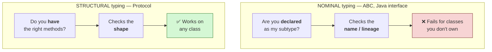

> [!WARNING]
> **Protocols are only as strong as your CI pipeline.** Plain Python will happily run `checkout("not a payment method", 450)` and fail later. The enforcement comes from running `mypy` or `pyright` as a build step. Without that, a Protocol is documentation.

---

### Example 14 — `@runtime_checkable` and its two sharp limits

```python
from typing import Protocol, runtime_checkable

@runtime_checkable
class Payable(Protocol):
    def pay(self, amount: float) -> str: ...

class GoodSDK:
    def pay(self, amount): return "ok"

class WrongSignature:
    def pay(self): return "I take no arguments at all"

class NotAPayment:
    def send_email(self): return "nope"

print("GoodSDK        :", isinstance(GoodSDK(), Payable))
print("WrongSignature :", isinstance(WrongSignature(), Payable), "  ⚠️")
print("NotAPayment    :", isinstance(NotAPayment(), Payable))
```

**Output:**
```
GoodSDK        : True
WrongSignature : True   ⚠️
NotAPayment    : False
```

**Explanation — limit 1.** `WrongSignature.pay()` takes **no parameters**. It is completely incompatible with `pay(450)`. `isinstance()` still says `True`.

`@runtime_checkable` checks only that **a method of that name exists**. It ignores parameters, types, and return values entirely.

**Limit 2** — protocols with data attributes cannot be used with `issubclass()`:

```python
from typing import Protocol, runtime_checkable

@runtime_checkable
class HasCurrency(Protocol):
    currency: str                     # a DATA member, not a method

class UPI:
    currency = "INR"

print("isinstance works :", isinstance(UPI(), HasCurrency))
try:
    issubclass(UPI, HasCurrency)
except TypeError as e:
    print("issubclass fails :", e)
```

**Output:**
```
isinstance works : True
issubclass fails : Protocols with non-method members don't support issubclass()
```

**Explanation:** `issubclass()` inspects the *class*, where an instance attribute may not yet exist — so Python refuses rather than give a wrong answer. `isinstance()` inspects a real object and works.

> [!TIP]
> Treat `@runtime_checkable` as a **smoke test**, never a guarantee. Only `mypy` checks signatures.

---

### Example 15 — `register()`: retroactive adoption, zero verification

```python
from abc import ABC, abstractmethod

class PaymentMethod(ABC):
    @abstractmethod
    def pay(self, amount): ...
    @abstractmethod
    def refund(self, amount): ...

class LegacyGateway:                  # ancient code, cannot be modified
    def pay(self, amount): return f"legacy charge ₹{amount}"
    def refund(self, amount): return f"legacy refund ₹{amount}"

PaymentMethod.register(LegacyGateway)          # 👈 retroactive adoption

print("issubclass :", issubclass(LegacyGateway, PaymentMethod))
print("isinstance :", isinstance(LegacyGateway(), PaymentMethod))
print("works      :", LegacyGateway().pay(450))

# ⚠️ Now the dangerous part
class TotallyUnrelated:
    """Has NONE of the required methods."""

PaymentMethod.register(TotallyUnrelated)
print("\nRegistered a class with no methods at all:")
print("issubclass  :", issubclass(TotallyUnrelated, PaymentMethod))
print("instantiable:", TotallyUnrelated() is not None)
try:
    TotallyUnrelated().pay(450)
except AttributeError as e:
    print("but calling :", e)
```

**Output:**
```
issubclass : True
isinstance : True
works      : legacy charge ₹450

Registered a class with no methods at all:
issubclass  : True
instantiable: True
but calling : 'TotallyUnrelated' object has no attribute 'pay'
```

**Explanation:** `register()` makes a class a **virtual subclass** — `issubclass()` and `isinstance()` say yes, but there is **no inheritance**. The class does not gain the ABC's concrete methods, and its `__mro__` is unchanged.

> [!WARNING]
> **`register()` performs zero verification.** We registered a class with none of the required methods and Python said `True`. It is a promise *you* make, taken entirely on trust — you have re-created the duck-typing problem with extra ceremony.
>
> Use it only for third-party classes you genuinely cannot modify, and write a test that actually calls each required method.

---

### Example 16 — `__subclasshook__`: teaching an ABC to recognise shapes

```python
from abc import ABC, abstractmethod

class Refundable(ABC):
    @abstractmethod
    def refund(self, amount): ...

    @classmethod
    def __subclasshook__(cls, C):
        """Called by issubclass(). Return True / False / NotImplemented."""
        if cls is Refundable:
            if any("refund" in B.__dict__ for B in C.__mro__):
                return True
            return NotImplemented        # fall back to normal rules
        return NotImplemented

class UPI:
    def refund(self, amount): return "refunded to UPI"

class PartnerWallet:
    def refund(self, amount): return "refunded to wallet"

class CashOnDelivery:
    def pay(self, amount): return "collect at door"

print("UPI             :", issubclass(UPI, Refundable))
print("PartnerWallet   :", issubclass(PartnerWallet, Refundable))
print("CashOnDelivery  :", issubclass(CashOnDelivery, Refundable))
print("isinstance      :", isinstance(UPI(), Refundable))
```

**Output:**
```
UPI             : True
PartnerWallet   : True
CashOnDelivery  : False
isinstance      : True
```

**Explanation:** `__subclasshook__` lets *you* define what counts as a subclass. Here the rule is "has a `refund` method anywhere in its MRO" — so `UPI` and `PartnerWallet` qualify automatically without inheriting or registering, while `CashOnDelivery` correctly does not.

This is how `collections.abc` works internally: `issubclass(list, Iterable)` is `True` because `Iterable.__subclasshook__` checks for `__iter__`, not because `list` inherits from anything.

Two rules for writing one:
- Guard with `if cls is Refundable:` so subclasses don't accidentally inherit the hook's logic.
- Return `NotImplemented` (not `False`) when your rule doesn't apply, so Python falls back to normal inheritance and `register()` checks.

---

### Example 17 — `__init_subclass__`: killing the `if/elif` chain forever

This is the final answer to Swiggy's original problem.

```python
from abc import ABC, abstractmethod

REGISTRY = {}

class PaymentMethod(ABC):
    def __init_subclass__(cls, /, code=None, **kwargs):
        """Runs automatically each time a subclass is DEFINED."""
        super().__init_subclass__(**kwargs)
        if code:
            REGISTRY[code] = cls

    @abstractmethod
    def pay(self, amount): ...
    @abstractmethod
    def refund(self, amount): ...

class UPI(PaymentMethod, code="upi"):
    def pay(self, a): return f"Paid ₹{a} via UPI"
    def refund(self, a): return f"Refunded ₹{a} to UPI"

class Card(PaymentMethod, code="card"):
    def pay(self, a): return f"Paid ₹{a} via Card"
    def refund(self, a): return f"Refunded ₹{a} to Card"

class SwiggyMoney(PaymentMethod, code="swiggy_money"):
    def pay(self, a): return f"Paid ₹{a} via Swiggy Money"
    def refund(self, a): return f"Refunded ₹{a} to Swiggy Money"

print("Auto-registered:", sorted(REGISTRY))

# The user picks "swiggy_money" on the checkout screen
chosen = REGISTRY["swiggy_money"]()
print("pay   :", chosen.pay(450))
print("refund:", chosen.refund(450))          # ← works! No forgotten branch
```

**Output:**
```
Auto-registered: ['card', 'swiggy_money', 'upi']
pay   : Paid ₹450 via Swiggy Money
refund: Refunded ₹450 to Swiggy Money
```

**Explanation:** Compare this with Example 1. **There is no `if/elif` anywhere** — not in checkout, not in refund, not in receipts.

`__init_subclass__` is a hook that fires at **class definition time**, the moment Python finishes executing the class body. Every payment method registers itself.

Adding EMI tomorrow means writing **one class**. The dispatch code never changes, so there is no sixth file to forget.

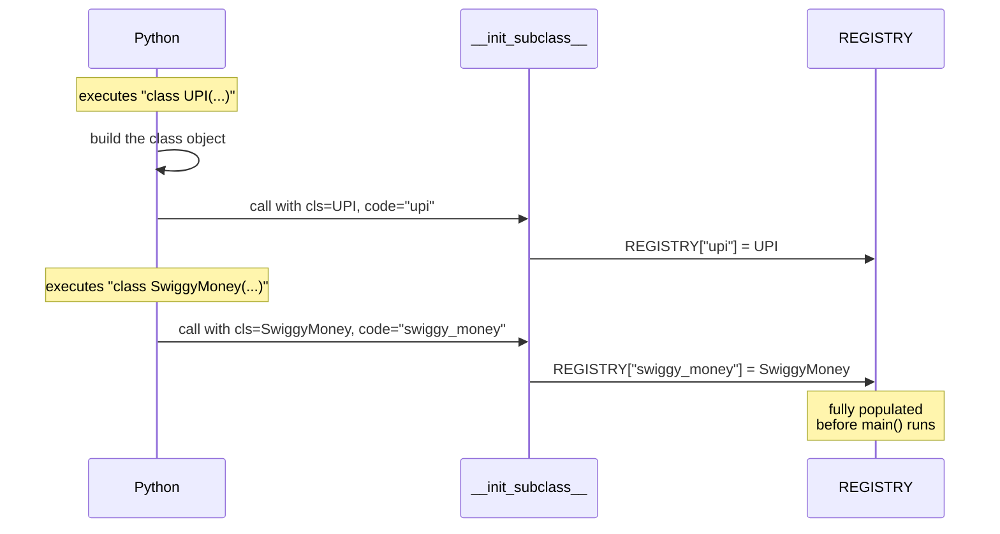

> [!TIP]
> This pattern powers Django's model registry and Flask's blueprint system. Whenever you see a framework that "just knows" about your classes, this or a metaclass is usually why.

---

### Example 18 — Choosing between all three, side by side

```python
from abc import ABC, abstractmethod
from typing import Protocol, runtime_checkable

# ---------- 1. DUCK TYPING ----------
def duck_checkout(method, amount):
    return method.pay(amount)

# ---------- 2. ABC ----------
class ABCPayment(ABC):
    @abstractmethod
    def pay(self, amount): ...
    def receipt(self, amount):                # free shared code
        return f"RECEIPT ₹{amount}"

class UPI(ABCPayment):
    def pay(self, amount): return f"UPI ₹{amount}"

# ---------- 3. PROTOCOL ----------
@runtime_checkable
class ProtoPayment(Protocol):
    def pay(self, amount) -> str: ...

class BankSDK:                                # inherits nothing
    def pay(self, amount): return f"SDK ₹{amount}"

print("Duck     :", duck_checkout(BankSDK(), 450))
print("ABC      :", UPI().pay(450), "|", UPI().receipt(450))
print("Protocol :", BankSDK().pay(450))
print()
print("ABC recognises third-party? :", isinstance(BankSDK(), ABCPayment))
print("Protocol recognises it?     :", isinstance(BankSDK(), ProtoPayment))
print("ABC gives free methods?     :", hasattr(UPI(), "receipt"))
print("Protocol gives free methods?:", hasattr(BankSDK(), "receipt"))
```

**Output:**
```
Duck     : SDK ₹450
ABC      : UPI ₹450 | RECEIPT ₹450
Protocol : SDK ₹450

ABC recognises third-party? : False
Protocol recognises it?     : True
ABC gives free methods?     : True
Protocol gives free methods?: False
```

**Explanation:** The last four lines are the entire decision, made concrete:

- **ABC cannot see a third-party class** (`False`) — but **gives your classes shared code** (`True`)
- **Protocol sees any class** (`True`) — but **gives nothing** (`False`)

You are choosing between **reach** and **reuse**.

| Situation | Choose |
|---|---|
| You own the classes; want shared code | **ABC** |
| Third-party classes; want loose coupling | **Protocol** |
| Both | ABC for your core + Protocol at the boundary |
| Script under 100 lines | **Duck typing** |

---

### Example 19 — One test suite, every implementation

A professional technique that only interfaces make possible.

```python
from abc import ABC, abstractmethod

class PaymentMethod(ABC):
    @abstractmethod
    def pay(self, amount): ...
    @abstractmethod
    def refund(self, amount): ...

class UPI(PaymentMethod):
    def pay(self, a): return f"Paid ₹{a} via UPI"
    def refund(self, a): return f"Refunded ₹{a} to UPI"

class Card(PaymentMethod):
    def pay(self, a): return f"Paid ₹{a} via Card"
    def refund(self, a): return f"Refunded ₹{a} to Card"

class SwiggyMoney(PaymentMethod):
    def pay(self, a): return f"Paid ₹{a} via Swiggy Money"
    def refund(self, a): return f"Refunded ₹{a} to Swiggy Money"


def contract_test(method: PaymentMethod):
    """The SAME test runs against EVERY implementation."""
    checks = []
    checks.append(("pay returns str", isinstance(method.pay(450), str)))
    checks.append(("refund returns str", isinstance(method.refund(450), str)))
    checks.append(("pay mentions amount", "450" in method.pay(450)))
    return checks

for cls in (UPI, Card, SwiggyMoney):
    results = contract_test(cls())
    status = "✅ PASS" if all(ok for _, ok in results) else "❌ FAIL"
    print(f"{cls.__name__:14} {status}  ({len(results)} checks)")
```

**Output:**
```
UPI            ✅ PASS  (3 checks)
Card           ✅ PASS  (3 checks)
SwiggyMoney    ✅ PASS  (3 checks)
```

**Explanation:** Because all three satisfy the same contract, **one test function validates all of them**. Add a fourth payment method and it is tested automatically — no new test file.

This is called a **contract test** or **interface test**, and it is standard practice at companies with pluggable architectures. It catches the class of bug where an implementation technically has the right method names but returns the wrong *kind* of thing — something `@abstractmethod` cannot check.

---

### Example 20 — Swiggy Payments, complete

Everything in this chapter, in one working system.

```python
from abc import ABC, abstractmethod
from typing import Protocol, runtime_checkable

REGISTRY = {}

class PaymentMethod(ABC):
    """Swiggy's payment contract."""

    def __init_subclass__(cls, /, code=None, **kwargs):
        super().__init_subclass__(**kwargs)
        if code:
            REGISTRY[code] = cls

    @property
    @abstractmethod
    def name(self) -> str: ...
    @abstractmethod
    def pay(self, amount: float) -> str: ...
    @abstractmethod
    def refund(self, amount: float) -> str: ...
    @abstractmethod
    def is_available(self) -> bool: ...

    def pay_with_fallback(self, amount, fallback=None):     # template method
        if self.is_available():
            return self.pay(amount)
        if fallback is not None:
            return f"[{self.name} down] " + fallback.pay(amount)
        return f"[{self.name} down] no fallback available"

    def receipt(self, amount):
        return f"SWIGGY | {self.name} | ₹{amount}"


class UPI(PaymentMethod, code="upi"):
    def __init__(self, vpa="user@okaxis", up=True):
        self.vpa, self.up = vpa, up
    @property
    def name(self): return "UPI"
    def pay(self, a): return f"Paid ₹{a} from {self.vpa}"
    def refund(self, a): return f"Refunded ₹{a} to {self.vpa}"
    def is_available(self): return self.up


class SwiggyMoney(PaymentMethod, code="swiggy_money"):
    def __init__(self, balance=1000): self.balance = balance
    @property
    def name(self): return "Swiggy Money"
    def pay(self, a):
        self.balance -= a
        return f"Paid ₹{a} from wallet (₹{self.balance} left)"
    def refund(self, a):
        self.balance += a
        return f"Refunded ₹{a} to wallet (₹{self.balance} now)"
    def is_available(self): return self.balance > 0


class FakePayment(PaymentMethod, code="fake"):
    """Tests only — no real money."""
    def __init__(self): self.log = []
    @property
    def name(self): return "Fake"
    def pay(self, a): self.log.append(("pay", a)); return f"FAKE pay ₹{a}"
    def refund(self, a): self.log.append(("refund", a)); return f"FAKE refund ₹{a}"
    def is_available(self): return True


@runtime_checkable
class Payable(Protocol):
    """Boundary contract — accepts third-party SDKs too."""
    def pay(self, amount: float) -> str: ...


class BankEMIClient:                       # third-party, no inheritance
    def pay(self, amount): return f"₹{amount} split into 3 EMIs by HDFC"


def checkout(method: Payable, amount): return method.pay(amount)


# ---- 1. Config-driven selection, NO if/elif (fixes the chain) ----
print("Registered:", sorted(REGISTRY))
chosen = REGISTRY["swiggy_money"]()
print(chosen.receipt(450))
print("pay   :", chosen.pay(450))
print("refund:", chosen.refund(450), "  ← the branch that was forgotten")

# ---- 2. Fallback when a method is down ----
print("\nUPI servers down:")
print(" ", UPI(up=False).pay_with_fallback(450, fallback=SwiggyMoney()))

# ---- 3. Testable without real money ----
fake = FakePayment()
checkout(fake, 450); fake.refund(450)
print("\nTest log:", fake.log)

# ---- 4. Third-party SDK accepted via Protocol ----
print("Bank EMI:", checkout(BankEMIClient(), 9000))
print("Is Payable?", isinstance(BankEMIClient(), Payable))

# ---- 5. Anjali's ₹47-lakh bug, now impossible ----
class BrokenMethod(PaymentMethod, code="broken"):
    @property
    def name(self): return "Broken"
    def pay(self, a): return "paid"
    def is_available(self): return True
    # refund() forgotten — exactly Anjali's mistake

try:
    BrokenMethod()
except TypeError as e:
    print("\n₹47-lakh bug caught at development time:")
    print(" ", e)
```

**Output:**
```
Registered: ['fake', 'swiggy_money', 'upi']
SWIGGY | Swiggy Money | ₹450
pay   : Paid ₹450 from wallet (₹550 left)
refund: Refunded ₹450 to wallet (₹1000 now)   ← the branch that was forgotten

UPI servers down:
  [UPI down] Paid ₹450 from wallet (₹550 left)

Test log: [('pay', 450), ('refund', 450)]
Bank EMI: ₹9000 split into 3 EMIs by HDFC
Is Payable? True

₹47-lakh bug caught at development time:
  Can't instantiate abstract class BrokenMethod without an implementation for abstract method 'refund'
```

**Explanation:** All four of Swiggy's problems, solved in one file:

| Problem | Line that fixes it |
|---|---|
| `if/elif` in 6 files | `REGISTRY[...]` — config-driven, zero branches |
| Missing refund branch → ₹47 lakh | `BrokenMethod()` raises `TypeError` **at development time** |
| Untestable (real money) | `FakePayment` — same contract, no money |
| Third-party bank SDK | `Protocol` accepts it without inheritance |

The last block is the point of the whole chapter. `BrokenMethod` is **exactly Anjali's bug** — the same forgotten `refund()`. It now fails on the developer's laptop, the first time they run the code, naming the missing method.

---

# 12. Memory Diagram

Where does the contract physically live? Not in your instances — in the **class objects**.

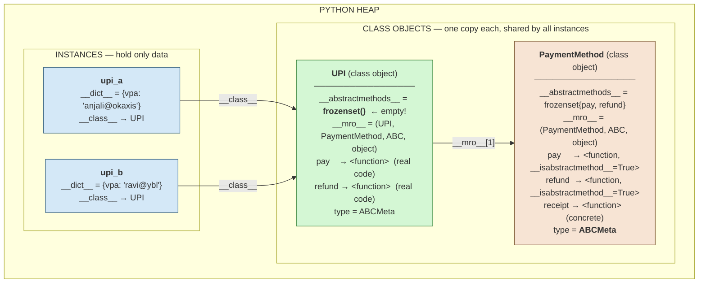

**Three things to take from this:**

1. **`__abstractmethods__` lives on the class, not the instance.** Two `UPI` objects don't each carry a copy.
2. **Each class gets its own frozenset.** `PaymentMethod` holds `{pay, refund}`; `UPI` holds an empty one.
3. **Instances store only data.** Methods are found by walking `__class__` → `__mro__`.

Verify it yourself:

```python
from abc import ABC, abstractmethod

class PaymentMethod(ABC):
    @abstractmethod
    def pay(self, a): ...
    @abstractmethod
    def refund(self, a): ...
    def receipt(self, a): return f"₹{a}"

class UPI(PaymentMethod):
    def __init__(self, vpa): self.vpa = vpa
    def pay(self, a): return f"Paid ₹{a}"
    def refund(self, a): return f"Refunded ₹{a}"

a, b = UPI("anjali@okaxis"), UPI("ravi@ybl")

print("Base  __abstractmethods__:", sorted(PaymentMethod.__dict__['__abstractmethods__']))
print("Child __abstractmethods__:", sorted(UPI.__dict__['__abstractmethods__']))
print("Instance a __dict__      :", a.__dict__)
print("Instance b __dict__      :", b.__dict__)
print("Instance has abstracts?  :", '__abstractmethods__' in a.__dict__)
print("MRO                      :", [c.__name__ for c in UPI.__mro__])
print("Same function object?    :", a.receipt.__func__ is b.receipt.__func__)
```

**Output:**
```
Base  __abstractmethods__: ['pay', 'refund']
Child __abstractmethods__: []
Instance a __dict__      : {'vpa': 'anjali@okaxis'}
Instance b __dict__      : {'vpa': 'ravi@ybl'}
Instance has abstracts?  : False
MRO                      : ['UPI', 'PaymentMethod', 'ABC', 'object']
Same function object?    : True
```

**Explanation:** The last line is the memory lesson. Both instances share **one** `receipt` function object stored in the class. The concrete method you wrote once is stored once, no matter how many instances exist. **The contract costs nothing per object.**

## Method lookup path

When you write `upi_a.receipt(450)`, Python walks the MRO:

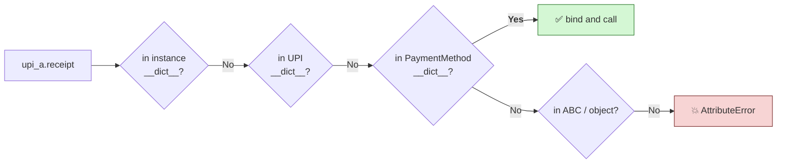

This is why a concrete method in the ABC is instantly available to every payment method — it sits one hop up the chain.

---

# 13. Internal Working

## 13.1 The two phases

Enforcement happens at two distinct moments. Confusing them is the most common conceptual error.

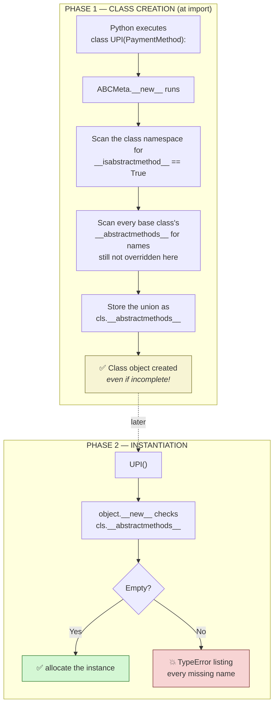

> [!IMPORTANT]
> **Phase 1 never raises.** You can define an incomplete class all day long. Only Phase 2 refuses. This is why Example 6's `class OnlinePayment(PaymentMethod)` was legal while `OnlinePayment()` was not — and it is a guaranteed interview question.

## 13.2 Rebuilding the mechanism by hand

The best way to prove you understand a mechanism is to rebuild it. `ABCMeta` is roughly this:

```python
class MyABCMeta(type):
    def __new__(mcls, name, bases, namespace, **kwargs):
        cls = super().__new__(mcls, name, bases, namespace, **kwargs)

        # 1. methods flagged in THIS class body
        abstracts = {n for n, v in namespace.items()
                     if getattr(v, "__isabstractmethod__", False)}

        # 2. inherited requirements not satisfied here
        for base in bases:
            for n in getattr(base, "__abstractmethods__", set()):
                value = getattr(cls, n, None)
                if getattr(value, "__isabstractmethod__", False):
                    abstracts.add(n)

        cls.__abstractmethods__ = frozenset(abstracts)
        return cls

    def __call__(cls, *args, **kwargs):
        if cls.__abstractmethods__:
            missing = ", ".join(repr(m) for m in sorted(cls.__abstractmethods__))
            word = "methods" if len(cls.__abstractmethods__) > 1 else "method"
            raise TypeError(f"Can't instantiate abstract class {cls.__name__} "
                            f"without an implementation for abstract {word} {missing}")
        return super().__call__(*args, **kwargs)


def my_abstractmethod(func):
    func.__isabstractmethod__ = True
    return func


class PaymentMethod(metaclass=MyABCMeta):
    @my_abstractmethod
    def pay(self, a): ...
    @my_abstractmethod
    def refund(self, a): ...

class UPI(PaymentMethod):
    def pay(self, a): return f"Paid ₹{a}"
    def refund(self, a): return f"Refunded ₹{a}"

class SwiggyMoney(PaymentMethod):
    def pay(self, a): return f"Paid ₹{a}"

print("PaymentMethod requires:", sorted(PaymentMethod.__abstractmethods__))
print("UPI requires          :", sorted(UPI.__abstractmethods__))
print("UPI works             :", UPI().pay(450))
try:
    SwiggyMoney()
except TypeError as e:
    print("SwiggyMoney blocked   :", e)
```

**Output:**
```
PaymentMethod requires: ['pay', 'refund']
UPI requires          : []
UPI works             : Paid ₹450
SwiggyMoney blocked   : Can't instantiate abstract class SwiggyMoney without an implementation for abstract method 'refund'
```

**Explanation:** That is the whole idea in 25 lines. There is no magic — just a metaclass that counts flags at class creation and refuses at instantiation.

> [!NOTE]
> CPython performs the real check inside `object.__new__` (C level) rather than `ABCMeta.__call__`. The observable behaviour is identical; my Python version puts it in `__call__` because that reads more clearly. CPython's real `ABCMeta` also handles `register()`, `__subclasshook__`, and caching.

## 13.3 The subclass cache

`ABCMeta` caches `issubclass()` results — otherwise `__subclasshook__` would re-run on every check.

```python
from abc import ABC, abstractmethod

class Refundable(ABC):
    @abstractmethod
    def refund(self, a): ...

class PartnerWallet:
    def refund(self, a): return "refunded"

print("Before register:", issubclass(PartnerWallet, Refundable))
Refundable.register(PartnerWallet)
print("After register :", issubclass(PartnerWallet, Refundable))
```

**Output:**
```
Before register: False
After register : True
```

**Explanation:** The first call returns `False` and caches that negative result. Yet the second call correctly returns `True`.

This works because `register()` bumps a global `_abc_invalidation_counter`. Every cached entry stores the counter value it was created under; when the counter changes, stale entries are discarded. A neat, cheap cache-invalidation trick.

## 13.4 How `Protocol` differs internally

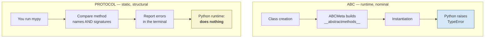

**An ABC error stops your program. A Protocol error stops your build** — but only if you have a build step that runs `mypy`.

## 13.5 Comparison with the JVM

| | **Python (CPython)** | **Java (JVM)** |
|---|---|---|
| When is conformance checked? | Class creation + instantiation, **at runtime** | **Compile time** by `javac` |
| What enforces it? | `ABCMeta` metaclass, ordinary Python objects | The compiler, then bytecode verification |
| Where is the contract stored? | `__abstractmethods__`, a normal frozenset | Constant pool + `ACC_INTERFACE` flags |
| Dispatch mechanism | Dict lookup walking the MRO | `invokeinterface` bytecode with vtables |
| Can you add conformance later? | ✅ `register()` at runtime | ❌ Fixed at compile time |
| Cost of a method call | Dictionary lookup (slower) | vtable index (very fast) |
| Failure mode | `TypeError` when you instantiate | Build fails; the program never runs |

> [!TIP]
> **The trade-off in one sentence:** the JVM gives you speed and certainty by deciding everything early; Python gives you flexibility by deciding everything late. `register()` is impossible in Java precisely because Java has already decided by the time the program starts.

---

# 14. Java vs Python

## 14.1 The same contract, both languages

```java
// ---------- JAVA ----------
public interface PaymentMethod {
    String pay(double amount);              // implicitly public abstract
    String refund(double amount);

    default String receipt(double amount) { // Java 8+ default method
        return "RECEIPT " + amount;
    }
}

public class UPI implements PaymentMethod {
    public String pay(double amount)    { return "Paid " + amount + " via UPI"; }
    public String refund(double amount) { return "Refunded " + amount; }
}
```

```python
# ---------- PYTHON ----------
from abc import ABC, abstractmethod

class PaymentMethod(ABC):
    @abstractmethod
    def pay(self, amount: float) -> str: ...

    @abstractmethod
    def refund(self, amount: float) -> str: ...

    def receipt(self, amount) -> str:       # same as a Java default method
        return f"RECEIPT ₹{amount}"

class UPI(PaymentMethod):
    def pay(self, amount): return f"Paid ₹{amount} via UPI"
    def refund(self, amount): return f"Refunded ₹{amount}"
```

## 14.2 Full comparison

| Aspect | Java | Python |
|---|---|---|
| Keyword | `interface` | none — `ABC` or `Protocol` |
| Declaring conformance | `implements X` | `class C(X)`, or nothing (Protocol) |
| Abstract method | implicit in an interface | `@abstractmethod` |
| Multiple interfaces | ✅ `implements A, B` | ✅ `class C(A, B)` |
| Multiple **class** inheritance | ❌ forbidden | ✅ allowed (MRO resolves it) |
| **When checked** | **compile time** | instantiation (ABC) / lint (Protocol) |
| Default methods | ✅ Java 8+ | ✅ always (ordinary methods in an ABC) |
| Static methods in interface | ✅ Java 8+ | ✅ `@staticmethod` |
| Fields | only `public static final` | any, though discouraged |
| Abstract properties | ❌ (getter methods instead) | ✅ `@property` + `@abstractmethod` |
| Structural typing | ❌ | ✅ `Protocol` |
| Retroactive conformance | ❌ needs an adapter class | ✅ `register()` |
| Custom subclass rules | ❌ | ✅ `__subclasshook__` |
| Failure mode | build fails | `TypeError` at instantiation |

## 14.3 The three differences that matter

### ① Timing — the big one

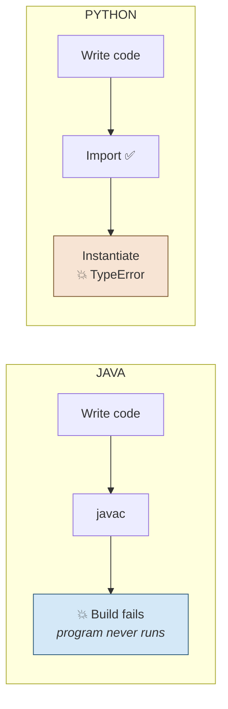

Java catches it before the program exists. Python catches it the first time you create the object. Python is **later** than Java but **enormously earlier** than duck typing — and that is the practical win.

> **Buy the compile-time guarantee back by adding `mypy` to CI.** That is how professional Python teams close the gap.

### ② Python has no interface/abstract-class split

Java needed both because a class can `implement` many interfaces but `extend` only one class, and interfaces could not hold code until Java 8.

Python allows multiple inheritance, so **`ABC` does both jobs**. All methods abstract → behaves like an interface. Mixed → behaves like an abstract class. Same tool, different usage.

### ③ Structural typing has no Java equivalent

```python
class BankEMIClient:            # never heard of Swiggy's code
    def pay(self, amount): return "EMI"

def checkout(m: Payable): ...   # accepts it anyway
```

In Java, `BankEMIClient` can never satisfy your interface without an **adapter class** wrapping it. Python's `Protocol` accepts it directly.

> [!WARNING]
> **Three Java habits to unlearn:**
>
> 1. **Don't prefix with `I`.** `IPaymentMethod` is a C#/Java convention. Python says `PaymentMethod`.
> 2. **Don't create an interface for every class.** Java teaches "always code to an interface" partly because mocking frameworks needed it. Python can duck-type; wait until you have a *second* implementation.
> 3. **Don't write getters and setters into the contract.** Use `@property` instead of `getName()`/`setName()`.

---
# 15. Common Mistakes

| # | Mistake | Why it happens | Fix |
|---|---|---|---|
| 1 | `@abstractmethod` without inheriting `ABC` | The decorator is visible, so it *looks* enforced | `class X(ABC):` |
| 2 | `@abstractmethod` above `@property` | Decorator order feels arbitrary | `@abstractmethod` **innermost** |
| 3 | Expecting the error at class **definition** | "Surely Python checks when it reads the class" | It checks at **instantiation** |
| 4 | Interface with 12 methods | "One contract for everything" | Apply ISP — split it |
| 5 | Interface for a single implementation | Java habit | Wait for the second one |
| 6 | `Protocol` with no `mypy` in CI | Assuming Python enforces it | Add `mypy` as a build step |
| 7 | `register()` as a shortcut | Easier than implementing | Only for un-editable third-party code |
| 8 | Expecting `runtime_checkable` to check signatures | It looks thorough | It checks **names only** |
| 9 | Naming it `IPaymentMethod` | C#/Java convention | Drop the `I` |
| 10 | Forgetting `super().__init_subclass__(**kwargs)` | Not obvious it's needed | Always call it |
| 11 | Assuming an abstract property needs a `@property` in the child | Seems logical | A plain attribute satisfies it |
| 12 | `if/elif` chain with no final `else: raise` | "It'll never reach there" | Always raise on unknown input |

---

### Mistake 1 — the invisible one 🚨

```python
from abc import abstractmethod          # ❌ ABC not imported

class PaymentMethod:                    # ❌ doesn't inherit ABC
    @abstractmethod
    def pay(self, amount): ...

class Broken(PaymentMethod):
    pass

print("No enforcement at all:", Broken().pay(450))
```

**Output:**
```
No enforcement at all: None
```

**Why this is dangerous:** the code *looks* like it has an interface. A reviewer sees `@abstractmethod` and approves it. There is zero enforcement, and nobody notices for months.

```python
from abc import ABC, abstractmethod      # ✅

class PaymentMethod(ABC):                # ✅
    @abstractmethod
    def pay(self, amount): ...

class Broken(PaymentMethod):
    pass

try:
    Broken()
except TypeError as e:
    print("Now enforced:", e)
```

**Output:**
```
Now enforced: Can't instantiate abstract class Broken without an implementation for abstract method 'pay'
```

---

### Mistake 2 — decorator order 🚨

```python
from abc import ABC, abstractmethod

print("Correct order — @property on top:")
class Right(ABC):
    @property
    @abstractmethod
    def name(self): ...
print("  required:", sorted(Right.__abstractmethods__))

class ChildOfRight(Right):
    pass                                # implements nothing
try:
    ChildOfRight()
except TypeError as e:
    print("  ChildOfRight blocked:", e)

print("\nReversed order — @abstractmethod on top:")
try:
    class Wrong(ABC):
        @abstractmethod
        @property
        def name(self): ...
except AttributeError as e:
    print(f"  {type(e).__name__}: {e}")
```

**Output:**
```
Correct order — @property on top:
  required: ['name']
  ChildOfRight blocked: Can't instantiate abstract class ChildOfRight without an implementation for abstract method 'name'

Reversed order — @abstractmethod on top:
  AttributeError: attribute '__isabstractmethod__' of 'property' objects is not writable
```

**Explanation:** Decorators apply **bottom-up**, so the inner one runs first.

- **Correct order** — `abstractmethod` marks the raw function (`func.__isabstractmethod__ = True`), then `property` wraps that already-marked function and *derives* its own abstractness from it. The flag survives. ✅
- **Reversed order** — `property` runs first, producing a `property` object. Then `abstractmethod` tries to set `__isabstractmethod__` on it — but on a `property` that attribute is **computed from the wrapped functions and is read-only**. Python raises `AttributeError` immediately.

> [!TIP]
> **Good news: this mistake is self-correcting on modern Python.** It fails loudly, at class-definition time, naming the exact problem. You cannot ship it.
>
> The rule is still stated emphatically in older books because in much earlier Python versions the reversed order failed **silently** — producing a non-abstract member and zero enforcement. If you read legacy material warning of silent failure, that is why.

The same applies to `@classmethod` and `@staticmethod`. **Rule to memorise:** `@abstractmethod` goes **innermost (bottom)**, always.

---

### Mistake 4 — the fat interface

```python
from abc import ABC, abstractmethod

# ❌ FAT
class PaymentFat(ABC):
    @abstractmethod
    def pay(self, amount): ...
    @abstractmethod
    def refund(self, amount): ...
    @abstractmethod
    def save_card(self): ...

class CashOnDeliveryFat(PaymentFat):
    def pay(self, a): return "collect at door"
    def refund(self, a): raise NotImplementedError("cash refunds are manual")   # 🚩
    def save_card(self): raise NotImplementedError("COD has no card")           # 🚩

# ✅ SEGREGATED
class Payable(ABC):
    @abstractmethod
    def pay(self, amount): ...

class Refundable(ABC):
    @abstractmethod
    def refund(self, amount): ...

class CashOnDelivery(Payable):
    def pay(self, a): return f"₹{a} at the door"

class UPI(Payable, Refundable):
    def pay(self, a): return f"Paid ₹{a} via UPI"
    def refund(self, a): return f"Refunded ₹{a} to UPI"

print("COD pays  :", CashOnDelivery().pay(450))
print("UPI pays  :", UPI().pay(450))
print("UPI refunds:", UPI().refund(450))
print("Is COD Refundable?", isinstance(CashOnDelivery(), Refundable))
```

**Output:**
```
COD pays  : ₹450 at the door
UPI pays  : Paid ₹450 via UPI
UPI refunds: Refunded ₹450 to UPI
Is COD Refundable? False
```

> [!TIP]
> **The diagnostic:** if a class satisfies an interface by writing `raise NotImplementedError`, the interface is too big. That exception is your design telling you it is unhappy.

---

### Mistake 11 — abstract properties are looser than you think

```python
from abc import ABC, abstractmethod

class PaymentMethod(ABC):
    @property
    @abstractmethod
    def name(self) -> str: ...

class WithProperty(PaymentMethod):
    @property
    def name(self): return "UPI"

class WithPlainAttribute(PaymentMethod):
    name = "Card"                          # not a property at all!

class WithWrongType(PaymentMethod):
    name = 12345                            # not even a string!

print("Property   :", WithProperty().name)
print("Plain attr :", WithPlainAttribute().name)
print("Wrong type :", WithWrongType().name)
```

**Output:**
```
Property   : UPI
Plain attr : Card
Wrong type : 12345
```

**Explanation:** All three instantiate. Python checks only that **the name exists** in the subclass — not that it is still a property, not that its type matches the annotation.

> [!WARNING]
> **`@abstractmethod` guarantees *presence*, never *correctness*.** It cannot check signatures, types, or behaviour. For those you need `mypy` (types), contract tests (behaviour), and code review (judgement). An interface is the **first** line of defence, not the only one.

---

# 16. Best Practices

## ✅ Do

| Practice | Why |
|---|---|
| **Keep interfaces small** — 1 to 4 methods | Easy to implement, easy to satisfy honestly |
| **Name by capability** — `Payable`, `Refundable`, `Closeable` | The name states the promise |
| **Type-hint against the interface**, never the concrete class | `def f(m: PaymentMethod)` keeps you swappable |
| **Docstring every abstract method** | The docstring *is* the specification |
| **Use `Protocol` at boundaries, `ABC` in the core** | Liberal in what you accept, strict internally |
| **Put shared logic in concrete ABC methods** | Write `receipt()` once, not five times |
| **Inherit from `collections.abc`** for container-like classes | Free mixin methods |
| **Write one contract test run against every implementation** | Catches what `@abstractmethod` can't |
| **Run `mypy --strict` in CI** if you rely on Protocols | Otherwise they're only documentation |
| **Inject dependencies as parameters** | Testability follows automatically |

## ❌ Don't

| Anti-pattern | Instead |
|---|---|
| Interface before the **second** implementation exists | Wait. Premature abstraction is a real cost |
| Mutable state in an interface | Contracts describe behaviour |
| `register()` to skip writing methods | Actually implement them |
| `IPaymentMethod` naming | `PaymentMethod` |
| Interfaces for every class "because Java" | Python has duck typing; use it |
| Assuming an ABC checks types | It checks names only |

## The professional template

```python
"""Payment method contract for Swiggy checkout."""
from abc import ABC, abstractmethod


class PaymentMethod(ABC):
    """A pluggable payment method.

    Implementations must be idempotent: calling pay() twice with the
    same idempotency key must charge the customer only once.
    """

    @property
    @abstractmethod
    def name(self) -> str:
        """Display name shown at checkout, e.g. 'UPI'."""

    @abstractmethod
    def pay(self, amount: float) -> str:
        """Charge `amount` to the customer.

        Returns:
            A transaction reference string.
        Raises:
            PaymentError: if the charge is declined.
        """

    @abstractmethod
    def is_available(self) -> bool:
        """Return False if unusable right now. Must not raise."""

    # ---- provided; override only with good reason ----
    def pay_with_fallback(self, amount, fallback=None):
        """Try this method, else the fallback. Built on the abstracts above."""
        if self.is_available():
            return self.pay(amount)
        if fallback is not None:
            return fallback.pay(amount)
        raise RuntimeError(f"{self.name} unavailable and no fallback")
```

**What reviewers look for, in order:**

1. Is the contract **small** enough that a new payment method is a day's work?
2. Does every abstract method have a docstring stating **returns** and **raises**?
3. Is shared logic in **concrete** methods rather than duplicated?
4. Does application code type-hint the **interface**, not `UPI`?
5. Is there a **test double** (`FakePayment`) proving the seam works?
6. Is `mypy` in CI?

---

# 17. Interview Questions

## 17.1 Conceptual

<details>
<summary><b>Q1. Python has no <code>interface</code> keyword. Does Python have interfaces? ⭐</b></summary>

Yes — three mechanisms at different strengths.

1. **Duck typing** — the implicit interface. No declaration, no enforcement, maximum flexibility. Fails at call time.
2. **ABC** (`abc.ABC` + `@abstractmethod`) — *nominal* typing. Python enforces it at **instantiation**. Can also supply shared concrete methods.
3. **Protocol** (`typing.Protocol`, PEP 544) — *structural* typing. Enforced by `mypy`/`pyright`. Works on classes you do not own.

The architectural difference from Java: Java's interface is a **compile-time** contract; Python's is enforced either at instantiation or by a separate static checker.
</details>

<details>
<summary><b>Q2. Difference between an abstract class and an interface in Python?</b></summary>

In Python the distinction largely dissolves — both are `ABC`. It is a matter of usage:

- **Every** method abstract → functions as an interface (pure contract).
- Mix of abstract and concrete → functions as an abstract class (contract + shared code).

Java kept them separate because a class can `implement` many interfaces but `extend` only one class, and interfaces could not hold code until Java 8. Python's multiple inheritance removes the need for two mechanisms.
</details>

<details>
<summary><b>Q3. When exactly does an ABC violation raise? ⭐</b></summary>

At **instantiation**, not definition.

```python
class Bad(PaymentMethod):     # ✅ defining is fine — no error
    pass
Bad()                          # 💥 TypeError here
```

Mechanism: `ABCMeta` computes `__abstractmethods__` at class-creation time; `object.__new__` checks whether that frozenset is empty at instantiation.

Follow-up they often ask: *"Why not raise at definition?"* Because an incomplete subclass is legitimately useful as an intermediate class — like `OnlinePayment` adding shared helpers while leaving `pay()` to its children.
</details>

<details>
<summary><b>Q4. ABC vs Protocol — which would you choose? ⭐</b></summary>

- **ABC** when you own the hierarchy, want runtime enforcement, or want to donate concrete/mixin code (like `collections.abc.Sequence` giving you `__contains__` free).
- **Protocol** when you do not control the classes (third-party SDKs), want zero coupling, or are writing library code that should accept anything of the right shape.

In one line: **ABC has reach into your code and gives you reuse; Protocol has reach into anyone's code and gives you nothing.**

A strong answer mentions using **both**: `Protocol` for what your module *accepts*, `ABC` for your internal hierarchy.
</details>

<details>
<summary><b>Q5. What does <code>@abstractmethod</code> actually do?</b></summary>

Almost nothing on its own. It sets one attribute:

```python
func.__isabstractmethod__ = True
```

All enforcement lives in the `ABCMeta` metaclass, which scans for that flag at class creation and builds `__abstractmethods__`.

**Consequence:** `@abstractmethod` on a class that does not inherit `ABC` (or use `metaclass=ABCMeta`) has **zero effect**. This is the most common interface bug in Python.
</details>

<details>
<summary><b>Q6. What is the difference between nominal and structural typing?</b></summary>

- **Nominal** — membership by *declaration*. "Are you declared as my subtype?" Java interfaces, Python ABCs.
- **Structural** — membership by *shape*. "Do you have the right methods?" Go interfaces, TypeScript, Python Protocols.

Structural typing is what makes duck typing safe: you keep the flexibility of "any class with the right methods" while gaining a written, checkable contract.
</details>

## 17.2 Scenario

<details>
<summary><b>Q7. Design a payment system supporting UPI, Card, Wallet, and COD. ⭐</b></summary>

```python
from abc import ABC, abstractmethod

class Payable(ABC):
    @abstractmethod
    def pay(self, amount) -> str: ...
    @abstractmethod
    def is_available(self) -> bool: ...

    def pay_with_fallback(self, amount, fallback=None):
        if self.is_available():
            return self.pay(amount)
        return fallback.pay(amount) if fallback else None

class Refundable(ABC):
    @abstractmethod
    def refund(self, amount) -> str: ...
```

Talking points that earn marks:

- **ISP applied:** COD implements only `Payable`, not `Refundable` — because a cash order genuinely cannot be refunded online. Forcing it would produce a `NotImplementedError` lie.
- `is_available()` in the contract is what **enables** the fallback chain.
- `pay_with_fallback` is **concrete** → written once, not five times.
- Adding EMI touches **zero** existing code (Open/Closed).
- Mention a `FakePayment` double, since testing real payments costs real money.
- Mention `__init_subclass__` registration so config picks the method with no `if/elif`.
</details>

<details>
<summary><b>Q8. Your codebase has the same <code>if/elif</code> payment chain in 6 files. How do you refactor it?</b></summary>

This is Swiggy's actual problem. The answer is a sequence, not one trick:

1. **Define the contract first** — write `PaymentMethod` (ABC) capturing only the operations actually used. Derive the surface area by grepping every chain.
2. **One class per branch** — move each `elif` body into its own class. Behaviour unchanged, risk near zero.
3. **Replace chains with polymorphism** — `checkout()` becomes `method.pay(amount)`.
4. **Add a registry** via `__init_subclass__` so config selects the class.
5. **Write `FakePayment`** — now the suite runs without real money.
6. **Delete the last chain** — and adding a method can never again mean editing six files.

The key insight to state: **the interface is not the refactor — it is the thing that makes the refactor safe.** Steps 1–3 deliver value even if you stop there.
</details>

<details>
<summary><b>Q9. You must integrate a bank SDK that has the right methods but cannot inherit your base class.</b></summary>

Three options, in order of preference:

1. **`Protocol`** — define a structural contract. The SDK satisfies it by shape, verified by `mypy`. Zero coupling, zero wrapper code. **Preferred.**
2. **Adapter class** — write `BankEMIAdapter(PaymentMethod)` wrapping the SDK and delegating. More code, but you can normalise naming, error types, and return values. Choose this when the SDK's shape is *close* but not identical.
3. **`register()`** — declare it a virtual subclass. Fastest, but performs **zero verification**; back it with tests that actually call each method.

Option 2 is often best in practice, because third-party SDKs rarely match your contract exactly — the adapter is where you translate their exceptions into yours.
</details>

## 17.3 Coding

<details>
<summary><b>Q10. Implement a <code>Shape</code> interface with area and perimeter, plus a comparison utility.</b></summary>

```python
from abc import ABC, abstractmethod
import math

class Shape(ABC):
    @abstractmethod
    def area(self) -> float: ...
    @abstractmethod
    def perimeter(self) -> float: ...

    def describe(self) -> str:                      # concrete
        return f"{type(self).__name__}: area={self.area():.2f}, perimeter={self.perimeter():.2f}"

class Circle(Shape):
    def __init__(self, r): self.r = r
    def area(self): return math.pi * self.r ** 2
    def perimeter(self): return 2 * math.pi * self.r

class Rectangle(Shape):
    def __init__(self, w, h): self.w, self.h = w, h
    def area(self): return self.w * self.h
    def perimeter(self): return 2 * (self.w + self.h)

shapes = [Circle(3), Rectangle(4, 5)]
for s in shapes:
    print(s.describe())
print("Largest:", max(shapes, key=lambda s: s.area()).describe())
```

**Output:**
```
Circle: area=28.27, perimeter=18.85
Rectangle: area=20.00, perimeter=18.00
Largest: Circle: area=28.27, perimeter=18.85
```

Bonus marks for: `describe()` being concrete rather than duplicated, and `max(key=...)` working polymorphically across shape types.
</details>

<details>
<summary><b>Q11. Write a Protocol accepting any object with <code>read()</code>, and prove a stdlib class satisfies it.</b></summary>

```python
from typing import Protocol, runtime_checkable
import io

@runtime_checkable
class Readable(Protocol):
    def read(self, size: int = -1) -> str: ...

class MyBuffer:
    def __init__(self, text): self._t = text
    def read(self, size=-1): return self._t

def consume(source: Readable) -> str:
    return source.read().upper()

print(consume(MyBuffer("hello")))
print(consume(io.StringIO("from stringio")))
print("StringIO satisfies it:", isinstance(io.StringIO(), Readable))
```

**Output:**
```
HELLO
FROM STRINGIO
StringIO satisfies it: True
```

The point to make: `io.StringIO` is standard-library code that has never heard of `Readable`, yet satisfies it structurally.
</details>

## 17.4 Tricky ⭐

<details>
<summary><b>Q12. What does this print?</b></summary>

```python
from abc import ABC, abstractmethod

class A(ABC):
    @abstractmethod
    def run(self): ...

class B(A):
    pass

class C(B):
    def run(self): return "ok"

print(C().run())
try:
    B()
except TypeError:
    print("B failed")
```

**Answer:** `ok` then `B failed`.

`B` inherits the abstract `run` without implementing it, so `B.__abstractmethods__` is still `{'run'}` — `B` cannot be instantiated. `C` implements it, clearing the frozenset.

**The principle:** abstractness propagates down the MRO until someone implements it. Note also that *defining* `B` raised nothing.
</details>

<details>
<summary><b>Q13. Will this raise? Why or why not?</b></summary>

```python
from abc import ABC, abstractmethod

class Base(ABC):
    @abstractmethod
    def go(self): ...

class Impl:
    pass                       # NO methods at all

Base.register(Impl)
print(issubclass(Impl, Base))
print(Impl())
```

**Answer:** prints `True` and creates the instance happily. **No error.**

`register()` performs **zero verification**. It creates a *virtual* subclass — `issubclass`/`isinstance` return `True`, but there is no inheritance, `Impl.__mro__` is unchanged, and the abstract-method check never applies because `Impl` is not a real subclass.

The sharpest edge in the whole ABC system, and a favourite trick question.
</details>

<details>
<summary><b>Q14. Does <code>@runtime_checkable</code> check method signatures?</b></summary>

**No.** It checks only that a method of that **name** exists.

```python
@runtime_checkable
class P(Protocol):
    def pay(self, amount: float) -> str: ...

class Wrong:
    def pay(self): return "no args"     # incompatible

print(isinstance(Wrong(), P))           # True (!)
```

Calling `Wrong().pay(450)` raises `TypeError`. Only `mypy` catches this before runtime.

A second limit worth mentioning: protocols with **non-method members** raise `TypeError` on `issubclass()`, though `isinstance()` still works.
</details>

<details>
<summary><b>Q15. Can an ABC have a constructor? Can you call it?</b></summary>

Yes to both.

```python
from abc import ABC, abstractmethod

class PaymentMethod(ABC):
    def __init__(self, currency="INR"):
        self.currency = currency            # shared init logic

    @abstractmethod
    def pay(self, amount): ...

class UPI(PaymentMethod):
    def __init__(self, vpa, currency="INR"):
        super().__init__(currency)          # ✅ call the ABC's __init__
        self.vpa = vpa
    def pay(self, amount): return f"{self.currency} {amount} from {self.vpa}"

u = UPI("anjali@okaxis")
print(u.pay(450))
```

**Output:** `INR 450 from anjali@okaxis`

You cannot instantiate `PaymentMethod` **directly** (it has abstract methods), but its `__init__` runs normally via `super()`. This is standard for validation or shared setup.
</details>

<details>
<summary><b>Q16. What is the output, and why is it surprising?</b></summary>

```python
from abc import ABC, abstractmethod

class PaymentMethod(ABC):
    @property
    @abstractmethod
    def name(self) -> str: ...

class UPI(PaymentMethod):
    name = 42            # not a property, not even a string

print(UPI().name)
```

**Answer:** prints `42`. No error.

Python's abstract-method check verifies only that **the name is present** in the subclass. It does not verify that it is still a property, and type annotations are never enforced at runtime.

The lesson: `@abstractmethod` guarantees **presence**, not **correctness**. Types need `mypy`; behaviour needs contract tests. This is exactly where Java's compiler is genuinely stronger.
</details>

---
# 18. Advanced Case Study: CloudVault

> [!NOTE]
> **Read this section only after you are comfortable with everything above.** Swiggy payments taught you the *concept*. This section shows the same concept at **production scale**, in a domain with more moving parts. If any of it feels unclear, go back to Section 8 — the idea is identical; only the surroundings are bigger.

## The company

**CloudVault** stores files for other businesses — think Dropbox for companies. 400 customers, 80 million files. For three years everything lived on **Amazon S3**.

Then, over eighteen months, four things happened. Each maps to something you already know.

---

### 📅 Month 1 — The enterprise customer

A bank signs a ₹4-crore contract with one condition: *by law our data cannot leave Indian government-approved infrastructure. You must support Azure.*

The lead engineer searches the codebase for `s3`.

**1,847 matches. Across 213 files.**

`boto3.client('s3')` is called directly inside the upload handler, the thumbnail generator, the billing report, the audit logger, the virus scanner, and — inexplicably — the password-reset email template.

> **This is Swiggy's `if/elif` problem, one level up.** Swiggy's chain was duplicated in 6 files; CloudVault's vendor call is duplicated in 213. Same disease, bigger scale.

**The fix you already know:** define a `StorageBackend` contract; application code depends on it instead of on Amazon.

---

### 📅 Month 4 — The missing method

A junior developer writes the Azure backend by copying the S3 one. Careful work: `upload()`, `download()`, `delete()`, `get_url()`.

The S3 class had a **fifth** method: `exists()`. Used in exactly one place — the deduplication check that stops customers being billed twice for the same file.

Nothing warned her. It imported fine, instantiated fine, and every unit test passed because she wrote the tests against her own class.

Three weeks later: **60,000 customers double-billed.**

> **This is Anjali's bug, exactly.** Same shape, different domain. And the same three lines of `@abstractmethod` prevent it.

---

### 📅 Month 9 — The 40-minute test suite

CloudVault's tests uploaded real files to a real S3 bucket. 40 minutes per run. ₹18,000/month in transfer costs. When AWS had an outage, **the test suite failed** — even though no CloudVault code had changed.

Someone suggested a fake in-memory storage class. But `upload_handler()` imported `boto3` at the top of the file. **There was no seam.**

> **This is Swiggy's "testing costs real money" problem.** The fix is the same: dependency injection plus a test double.

---

### 📅 Month 14 — The acquisition

CloudVault buys a competitor whose files sit on **Google Cloud Storage**. The competitor's SDK is a third-party package: a class called `GCSBucket`.

It cannot inherit from CloudVault's base class. **They do not own that code.**

> **This is the bank-SDK problem.** `Protocol` solves it.

---

## The complete solution

```mermaid
classDiagram
    class StorageBackend {
        <<abstract>>
        +name* str
        +upload(filename, data)* str
        +download(filename)* bytes
        +delete(filename)* bool
        +exists(filename)* bool
        +copy(src, dst) str
        +describe() str
    }
    class S3Storage
    class AzureStorage
    class LocalStorage
    class InMemoryStorage {
        note "tests only"
    }
    StorageBackend <|-- S3Storage
    StorageBackend <|-- AzureStorage
    StorageBackend <|-- LocalStorage
    StorageBackend <|-- InMemoryStorage
```

```python
from abc import ABC, abstractmethod
from typing import Protocol, runtime_checkable

REGISTRY = {}

class StorageBackend(ABC):
    """CloudVault's storage contract."""

    def __init_subclass__(cls, /, code=None, **kwargs):
        super().__init_subclass__(**kwargs)
        if code:
            REGISTRY[code] = cls

    @property
    @abstractmethod
    def name(self) -> str: ...
    @abstractmethod
    def upload(self, filename: str, data: bytes) -> str: ...
    @abstractmethod
    def download(self, filename: str) -> bytes: ...
    @abstractmethod
    def delete(self, filename: str) -> bool: ...
    @abstractmethod
    def exists(self, filename: str) -> bool: ...

    def copy(self, src, dst):                       # template method
        if not self.exists(src):
            raise FileNotFoundError(f"{src} missing on {self.name}")
        return self.upload(dst, self.download(src))

    def describe(self):
        return f"<{type(self).__name__} backend={self.name}>"


class S3Storage(StorageBackend, code="s3"):
    def __init__(self, bucket="cloudvault"):
        self.bucket, self._d = bucket, {}
    @property
    def name(self): return "s3"
    def upload(self, f, d): self._d[f] = d; return f"s3://{self.bucket}/{f}"
    def download(self, f): return self._d[f]
    def delete(self, f): return self._d.pop(f, None) is not None
    def exists(self, f): return f in self._d


class InMemoryStorage(StorageBackend, code="memory"):
    """The class that fixed the 40-minute test suite."""
    def __init__(self): self._d = {}
    @property
    def name(self): return "memory"
    def upload(self, f, d): self._d[f] = d; return f"mem://{f}"
    def download(self, f): return self._d[f]
    def delete(self, f): return self._d.pop(f, None) is not None
    def exists(self, f): return f in self._d


@runtime_checkable
class Uploadable(Protocol):
    def upload(self, filename: str, data: bytes) -> str: ...

class GCSBucket:                                    # acquired third-party SDK
    def upload(self, filename, data): return f"gs://acquired/{filename}"

def archive(storage: Uploadable, filename, data):
    return storage.upload(filename, data)


# ---- Month 1 fixed: config-driven, zero vendor coupling ----
print("Registered:", sorted(REGISTRY))
backend = REGISTRY["s3"]()
print(backend.describe())
print("upload:", backend.upload("q3.pdf", b"REPORT"))
print("copy  :", backend.copy("q3.pdf", "q3-backup.pdf"))

# ---- Month 9 fixed: same code, no network ----
test_backend = REGISTRY["memory"]()
print(test_backend.describe(), "→", test_backend.upload("q3.pdf", b"REPORT"))

# ---- Month 14 fixed: third-party SDK via Protocol ----
print("GCS   :", archive(GCSBucket(), "old.pdf", b"X"))
print("Is Uploadable?", isinstance(GCSBucket(), Uploadable))

# ---- Month 4 fixed: the missing method is now impossible ----
class AzureStorage(StorageBackend, code="azure"):
    @property
    def name(self): return "azure"
    def upload(self, f, d): return f"azure://{f}"
    def download(self, f): return b""
    def delete(self, f): return True
    # exists() forgotten — the ₹18-lakh bug

try:
    AzureStorage()
except TypeError as e:
    print("\nMonth 4 bug caught at development time:")
    print(" ", e)
```

**Output:**
```
Registered: ['memory', 's3']
<S3Storage backend=s3>
upload: s3://cloudvault/q3.pdf
copy  : s3://cloudvault/q3-backup.pdf
<InMemoryStorage backend=memory> → mem://q3.pdf
GCS   : gs://acquired/old.pdf
Is Uploadable? True

Month 4 bug caught at development time:
  Can't instantiate abstract class AzureStorage without an implementation for abstract method 'exists'
```

## Swiggy and CloudVault side by side

**This table is the point of the whole section.** Two completely different companies, two completely different domains — **the same four problems and the same four fixes.**

| Problem | Swiggy | CloudVault | The fix |
|---|---|---|---|
| Logic duplicated everywhere | `if/elif` in 6 files | `boto3` in 213 files | **Contract + polymorphism** |
| Missing method | forgot `refund()` → ₹47 lakh | forgot `exists()` → ₹18 lakh | **`@abstractmethod`** |
| Untestable | testing costs real money | testing costs 40 min + AWS | **DI + test double** |
| Third-party class | bank EMI SDK | acquired `GCSBucket` | **`Protocol`** |

> [!TIP]
> **This is what "learning a concept" actually means.** You did not learn "how to write payment code." You learned a shape of problem, and now you can recognise it in a domain you have never seen.
>
> When you meet your third example — a notification system, a database driver, a game's enemy AI — you will recognise it in under a minute.

---

# 19. Practice Problems

## 🟢 Easy

1. **Shape hierarchy** — abstract `area()` and `perimeter()`; implement `Circle`, `Rectangle`, `Triangle`. Print the total area of a mixed list.
2. **Kill the chain** — take the `if/elif` refund function from Example 1 and rewrite it with classes. Prove that adding a fourth method needs zero edits to `refund()`.
3. **Prove the failure** — write an ABC with three abstract methods and a subclass implementing two. Catch the `TypeError` and print exactly which method is missing.
4. **Animal contract** — abstract `speak()` and `move()`; implement `Dog`, `Bird`, `Fish`. Add a concrete `introduce()` in the base that uses both.
5. **Duck vs ABC** — write the same payment scenario twice: once with duck typing (fails at call time), once with an ABC (fails at instantiation). Print both errors side by side.
6. **Vehicle with defaults** — abstract `start()` and `stop()`, plus a concrete `service_due(km)` returning `km > 10000`.

## 🟡 Medium

7. **Full payment system** — `PaymentMethod` ABC with `pay()`, `refund()`, abstract property `name`, and concrete `receipt()`. Implement UPI, Card, Wallet, NetBanking. Write `checkout()` accepting any of them.
8. **ISP refactor** — start from a fat `PaymentFat` with `pay`/`refund`/`save_card` where COD raises twice. Refactor into `Payable`, `Refundable`, `Tokenizable` and show correct `isinstance` filtering.
9. **Plugin registry** — an `Exporter` ABC with `CSVExporter`, `JSONExporter`, `XMLExporter`, auto-registered via `__init_subclass__`. Select one from a config dict with no `if/elif`.
10. **Protocol for a third party** — simulate an SDK class you "cannot modify". Write a `Protocol` it satisfies and a function accepting it. Show `isinstance` returning `True`.
11. **`collections.abc`** — build `Inventory(Mapping)` implementing only `__getitem__`, `__len__`, `__iter__`. Demonstrate `.keys()`, `.items()`, `.get()`, and `in` all working free.
12. **Dependency injection** — write `OrderService` taking a `PaymentMethod`. Test it with a fake, asserting the exact charges recorded.
13. **Contract test** — write one test function validating any `PaymentMethod`. Run it in a loop over four implementations, one of which deliberately returns the wrong type.
14. **`__subclasshook__`** — a `Serializable` ABC that automatically recognises any class defining `to_json`, without inheritance or `register()`.

## 🔴 Hard

15. **Multi-provider gateway** — `PaymentGateway` ABC with automatic fallback: try UPI, then Card, then Wallet. Track which succeeded. Handle the case where all fail.
16. **Interface versioning** — support `PaymentMethodV1` (no `is_available()`) and `V2` (with it). Write an adapter making a V1 satisfy V2, without breaking existing V1 implementations.
17. **Reimplement `ABCMeta`** — write `MyABCMeta` from scratch with `@my_abstractmethod`, inheritance-aware collection, and a correct error message listing all missing names. Test against 4 scenarios.
18. **Generic Protocol** — build `Repository[T]` with `get(id) -> T`, `save(item: T)`, `delete(id)`. Implement `UserRepository` and `OrderRepository`. Verify with `mypy --strict` that mixing them is an error.
19. **Runtime validator** — write `validate_implementation(cls, protocol)` using `inspect.signature` to check parameter names, count, and defaults — not just names. Make it catch the `WrongSignature` case that `runtime_checkable` misses.
20. **CloudVault for real** — implement `StorageBackend` with `S3` (dict-backed), `Local` (real files via `pathlib`), and `InMemory`. All three must pass the **same** contract test suite, run in a loop.

---

# 20. Mini Project

## 💳 PayHub — A Pluggable Payment Engine

Build a command-line checkout system. Every concept in this chapter appears at least once.

### The problem

An e-commerce checkout must support many payment methods and many notification channels. Both must be **independently pluggable** — adding a payment method must not touch notification code, and vice versa.

### Requirements

**Interfaces (ABC)**
- `PaymentMethod` — abstract `name` property, `pay()`, `refund()`, `is_available()`; concrete `receipt()` and `pay_with_fallback()` template method
- `Notifier` — abstract `send()`; concrete `send_with_retry()`
- At least one **concrete** method in each ABC that subclasses inherit

**Interface Segregation**
- Split `PaymentMethod` so that `CashOnDelivery` implements `Payable` but **not** `Refundable`
- No `raise NotImplementedError` anywhere in the final code

**Interfaces (Protocol)**
- A `Payable` Protocol at the system boundary
- A "third-party" bank SDK class satisfying it without inheritance

**Plugin registration**
- Both `PaymentMethod` and `Notifier` auto-register via `__init_subclass__`
- Selection driven purely by a config dict — **no `if/elif` chains anywhere**

**Dependency Injection & Testability**
- `CheckoutService` receives its payment method and notifier as constructor parameters
- `FakePayment` and `FakeNotifier` for tests
- Full test run completes with **zero** real transactions

**Contract testing**
- One test function run against **every** payment method in a loop

**Enforcement demo**
- Include a deliberately broken payment method missing one abstract method
- Catch and display the `TypeError`, proving the contract works

### Suggested structure

```
payhub/
├── contracts.py       # PaymentMethod, Notifier ABCs + Payable Protocol
├── methods.py         # UPI, Card, SwiggyMoney, CashOnDelivery
├── notifiers.py       # EmailNotifier, SMSNotifier, FakeNotifier
├── registry.py        # __init_subclass__ machinery
├── service.py         # CheckoutService (dependency injection)
├── test_contracts.py  # one suite run against EVERY implementation
└── main.py            # CLI demo
```

### Rubric

| Criterion | Marks |
|---|---|
| ABCs correctly defined; enforcement proven by a caught `TypeError` | 15 |
| At least one working **template method** per ABC | 10 |
| ISP applied — COD is `Payable` but not `Refundable`; no `NotImplementedError` | 10 |
| `Protocol` used for the third-party SDK | 10 |
| `__init_subclass__` registry; adding a method needs **zero** changes elsewhere | 15 |
| Dependency injection; tests run with no real transactions | 15 |
| One contract test executed against **all** implementations in a loop | 10 |
| `README.md` with a Mermaid class diagram | 10 |
| Type hints throughout; `mypy --strict` clean | 5 |

### Stretch goals

- Add a **fallback chain**: UPI → Card → Wallet, with logging of which succeeded
- Add `collections.abc.Sequence` support so `Cart` behaves like a list
- Add `__subclasshook__` so any class with `pay` is recognised as `Payable`
- Write `validate_implementation()` using `inspect.signature` to check signatures, not just names

---

# 21. Summary

## The journey

```mermaid
flowchart LR
    A["<b>if/elif</b><br/>Scattered logic<br/>💀 SILENT failure"] -->
    B["<b>Duck typing</b><br/>One class each<br/>Loud error<br/>💥 at call time"] -->
    C["<b>NotImplementedError</b><br/>Contract visible<br/>💥 still at call time"] -->
    D["<b>ABC</b><br/>Contract enforced<br/>✅ at instantiation"] -->
    E["<b>Protocol</b><br/>Any class<br/>✅ before you run"]

    style A fill:#f7d4d4,stroke:#7a2d2d
    style B fill:#f7e4d4,stroke:#7a552d
    style C fill:#f7f4d4,stroke:#7a752d
    style D fill:#d4e8f7,stroke:#2d5a7a
    style E fill:#d4f7d4,stroke:#2d7a2d
```

## Everything in one map

```mermaid
mindmap
  root((Interfaces<br/>in Python))
    Why
      Kill if/elif chains
      Contract discoverable
      Bug caught early
      Testable seams
    Duck Typing
      Implicit contract
      Zero ceremony
      Fails at call time
    ABC
      abc.ABC
      @abstractmethod
      Concrete methods allowed
      Abstract property
      Abstract classmethod
      Fails at instantiation
      collections.abc mixins
    Protocol
      typing.Protocol
      Structural typing
      No inheritance needed
      runtime_checkable
      Checked by mypy
    Advanced
      register
      __subclasshook__
      __init_subclass__
    Principles
      Interface Segregation
      Dependency Inversion
      Open Closed
```

## The twelve things to remember

| # | Principle |
|---|---|
| 1 | An interface moves a bug from **production** to **development** |
| 2 | An `if/elif` chain with no `else: raise` fails **silently** |
| 3 | `@abstractmethod` **does nothing** without `ABC` — it only sets a flag |
| 4 | Enforcement happens at **instantiation**, not class definition |
| 5 | Abstractness **propagates down** the MRO until someone implements it |
| 6 | An ABC **can contain working code** — its advantage over Protocol |
| 7 | `@abstractmethod` goes **innermost**; `@property` goes on top |
| 8 | `Protocol` = structural typing → works on classes you don't own |
| 9 | `runtime_checkable` checks **names only**, never signatures |
| 10 | `register()` performs **zero verification** |
| 11 | Small interfaces beat big ones (**ISP**) — `NotImplementedError` is the smell |
| 12 | An interface guarantees **presence**, never **correctness** |

## The decision, one last time

```mermaid
flowchart TD
    Q{"Do you own<br/>the classes?"}
    Q -->|"Yes"| Q2{"Need shared<br/>code?"}
    Q -->|"No — third party"| P["<b>Protocol</b>"]
    Q2 -->|"Yes"| A["<b>ABC</b><br/>with concrete methods"]
    Q2 -->|"No"| Q3{"Script under<br/>100 lines?"}
    Q3 -->|"Yes"| D["<b>Duck typing</b>"]
    Q3 -->|"No"| A2["<b>ABC</b>"]

    style A fill:#d4e8f7,stroke:#2d5a7a
    style A2 fill:#d4e8f7,stroke:#2d5a7a
    style P fill:#e4d4f7,stroke:#5a2d7a
    style D fill:#f7f4d4,stroke:#7a752d
```

---

# 22. Cheat Sheet

## Core syntax

```python
from abc import ABC, abstractmethod
from typing import Protocol, runtime_checkable

# ---------- ABC: nominal, runtime-enforced ----------
class PaymentMethod(ABC):
    @abstractmethod
    def pay(self, amount) -> str: ...          # REQUIRED

    def receipt(self, amount):                 # PROVIDED (free to subclasses)
        return f"₹{amount}"

    @property
    @abstractmethod                            # ⚠️ property ON TOP
    def name(self) -> str: ...

    @classmethod
    @abstractmethod                            # ⚠️ abstractmethod INNERMOST
    def from_config(cls, cfg): ...

    @staticmethod
    @abstractmethod
    def validate(amount) -> bool: ...

# ---------- Protocol: structural, mypy-enforced ----------
@runtime_checkable
class Payable(Protocol):
    def pay(self, amount: float) -> str: ...

# ---------- Advanced ----------
PaymentMethod.register(ThirdPartySDK)          # virtual subclass, NO checks

class Base(ABC):
    @classmethod
    def __subclasshook__(cls, C):              # custom issubclass rules
        if cls is Base:
            return any("pay" in B.__dict__ for B in C.__mro__) or NotImplemented
        return NotImplemented

class Plugin(ABC):
    def __init_subclass__(cls, /, code=None, **kw):   # auto-registry
        super().__init_subclass__(**kw)
        if code: REGISTRY[code] = cls
```

## Decision table

| Situation | Use |
|---|---|
| You own the hierarchy, want shared code | **ABC** |
| Third-party class, cannot inherit | **Protocol** |
| Container-like class (list/dict/set-like) | **`collections.abc`** |
| Small script, you own everything | **Duck typing** |
| Must adapt an unmodifiable class fast | **`register()`** (+ tests!) |
| Recognise any class with method X | **`__subclasshook__`** |
| Config-driven plugin selection | **`__init_subclass__`** |

## Enforcement timing

| Mechanism | Fails when | Caught by |
|---|---|---|
| `if/elif` chain | **never** — returns `None` | your customer 💀 |
| Duck typing | method is **called** | your customer |
| `NotImplementedError` | method is **called** | your customer |
| **ABC** | **instantiation** | you, in development |
| **Protocol** | **`mypy` run** | your CI, before merge |
| Java `interface` | **compilation** | the build |

## Free mixins from `collections.abc`

| Inherit | You implement | You get free |
|---|---|---|
| `Sequence` | `__getitem__`, `__len__` | `__contains__`, `__iter__`, `__reversed__`, `index`, `count` |
| `MutableSequence` | + `__setitem__`, `__delitem__`, `insert` | `append`, `extend`, `pop`, `remove`, `__iadd__` |
| `Mapping` | `__getitem__`, `__len__`, `__iter__` | `keys`, `values`, `items`, `get`, `__contains__`, `__eq__` |
| `Set` | `__contains__`, `__iter__`, `__len__` | `&`, `\|`, `-`, `^`, `isdisjoint`, comparisons |
| `Iterator` | `__next__` | `__iter__` |

## Gotchas checklist

| ⚠️ | Rule |
|---|---|
| `@abstractmethod` needs `ABC` | Otherwise **zero** enforcement |
| `@abstractmethod` innermost | `@property`/`@classmethod` above it |
| Error fires at **instantiation** | Defining an incomplete class is legal |
| `runtime_checkable` = names only | Signatures need `mypy` |
| `issubclass` fails on data Protocols | Use `isinstance` |
| `register()` verifies nothing | Back it with tests |
| Abstract property ≠ must be a property | A plain attribute satisfies it |
| No `I` prefix | `PaymentMethod`, not `IPaymentMethod` |

## Java → Python

| Java | Python |
|---|---|
| `interface X { }` | `class X(ABC):` |
| `implements X` | `class C(X):` |
| `abstract` method | `@abstractmethod` |
| `default` method | ordinary method in the ABC |
| `implements A, B` | `class C(A, B):` |
| compile-time check | instantiation check + `mypy` |
| adapter for 3rd-party | `Protocol` or `register()` |
| `IPayment` | `PaymentMethod` |

---

<div align="center">

### 📘 End of Chapter 1

**If you remember only one sentence:**

> *An interface is a promise about what an object can do,
> written in a place the computer can check.*

**And one number:**

> Anjali's forgotten `refund()` cost **₹47,00,000**.
> Three lines of `@abstractmethod` would have caught it in **20 seconds**.

</div>
